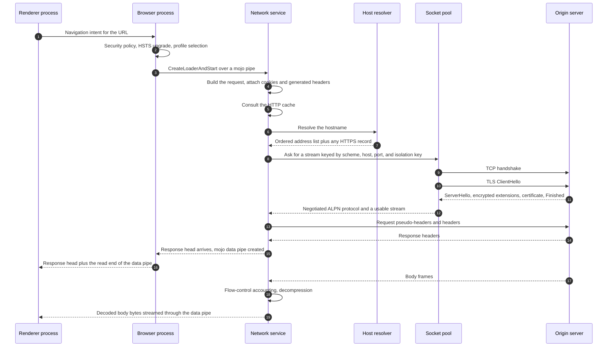
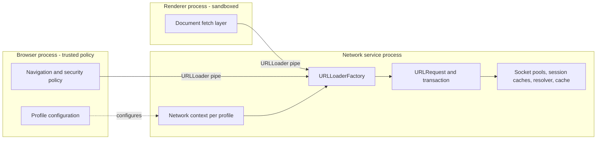
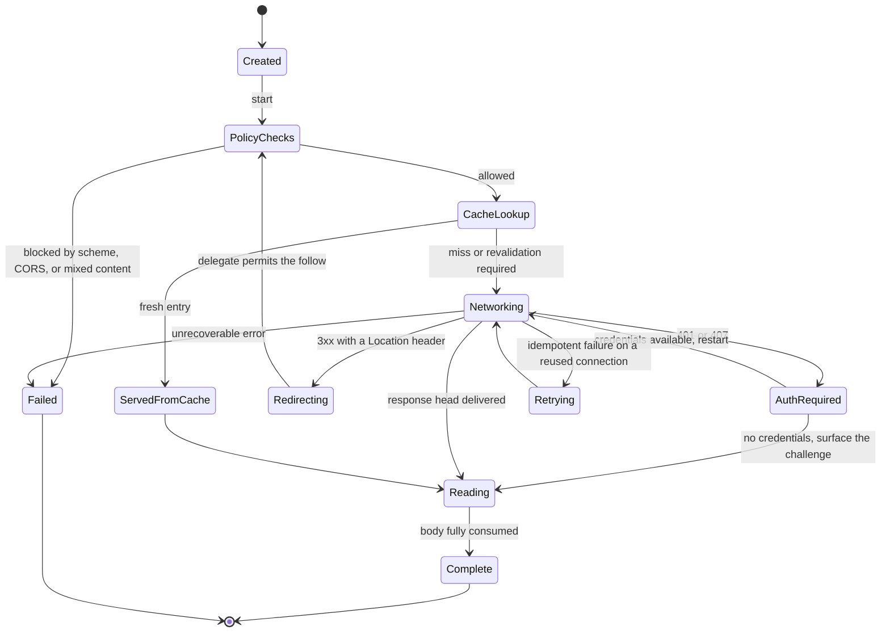
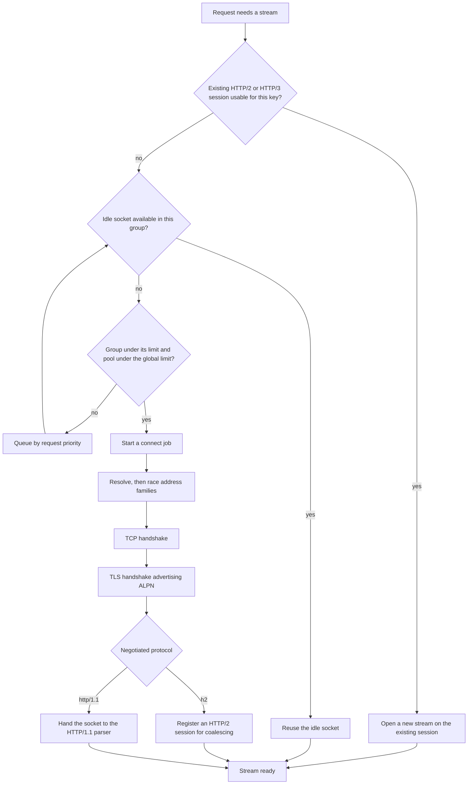
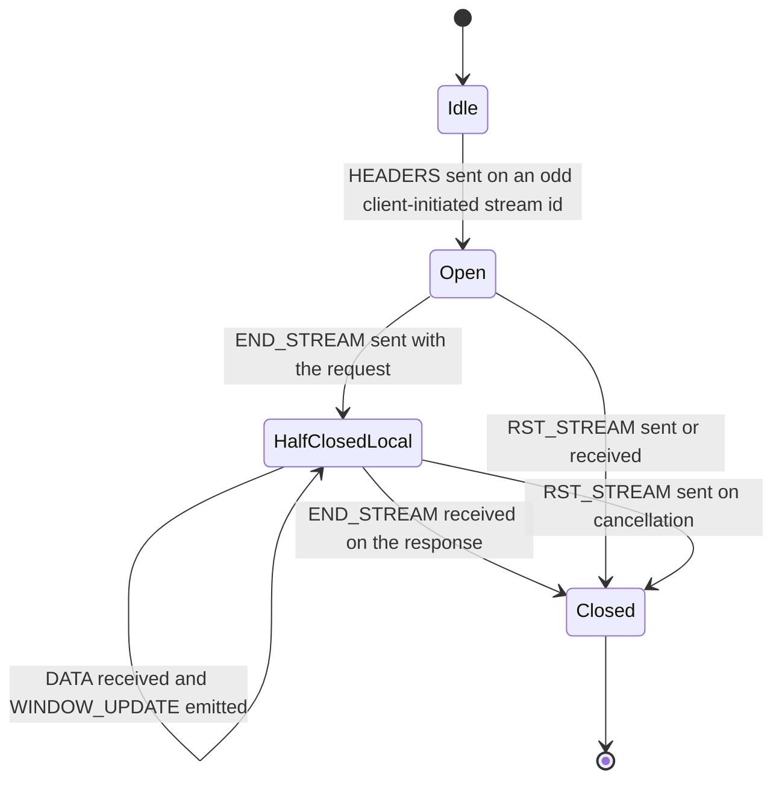

# Browser Networking Reference

**How a modern browser performs a network request, from URL submission to response bytes.**

This is the reference document for engineers building a browser-grade networking engine in
another language. It describes the architecture of Chromium's network stack, the protocol
behaviour that architecture produces on the wire, and the subset of that behaviour an
independent implementation must reproduce to be indistinguishable at the protocol level
from a real browser.

**Scope note.** This document is not about defeating bot detection. It is about
understanding protocol architecture and observable network behaviour precisely enough that
an independent, standards-compliant engine can be designed from first principles rather
than by trial and error. Everything described here is visible to any party holding one end
of the connection, and most of it is specified in published RFCs.

---

## Table of contents

- [1. Evidence conventions](#1-evidence-conventions)
- [2. The lifecycle of one request](#2-the-lifecycle-of-one-request)
- [3. Process model, the network service, and threading](#3-process-model-the-network-service-and-threading)
- [4. The loading pipeline](#4-the-loading-pipeline)
- [5. Name resolution](#5-name-resolution)
- [6. Connection management and socket pools](#6-connection-management-and-socket-pools)
- [7. TLS](#7-tls)
- [8. HTTP/1.1](#8-http11)
- [9. HTTP/2](#9-http2)
- [10. HTTP/3 and QUIC](#10-http3-and-quic)
- [11. Content encoding](#11-content-encoding)
- [12. Cookies](#12-cookies)
- [13. The HTTP cache](#13-the-http-cache)
- [14. Redirects and authentication](#14-redirects-and-authentication)
- [15. Header generation and browser identity](#15-header-generation-and-browser-identity)
- [16. The fingerprint surface](#16-the-fingerprint-surface)
- [17. Scheduling and prioritisation](#17-scheduling-and-prioritisation)
- [18. Performance architecture](#18-performance-architecture)
- [19. Security architecture](#19-security-architecture)
- [20. Telemetry](#20-telemetry)
- [21. Design principles](#21-design-principles)
- [22. Conformance checklist](#22-conformance-checklist)
- [Appendix A. The capture, field by field](#appendix-a-the-capture-field-by-field)

---

## 1. Evidence conventions

A reference document of this kind fails in a specific way: it accumulates plausible numbers
that nobody measured. To make that failure mode visible, every factual claim below carries
one of three provenances.

| Tag | Meaning |
| --- | --- |
| **M** | **Measured.** Read directly from `crates/chromulate-fingerprint/tests/data/chrome-151-macos.json`, a live capture of Google Chrome 151.0.0.0 on macOS taken on 2026-08-04 against `tls.peet.ws` over two separate TLS connections. |
| **S** | **Specified.** Required or defined by a published standard, named inline. |
| **G** | **General.** Documented browser behaviour or protocol-architecture knowledge this capture does not verify. Treat as a hypothesis to be measured before relying on it. |

Two consequences follow, and they are the reason for the convention.

Every concrete protocol constant here is tagged **M** or **S**. Where a value would be
useful but is neither in the capture nor in a standard — the per-host connection limit, the
DNS cache size, the idle-socket timeout — the behaviour is described qualitatively and the
number is deliberately omitted. Those numbers exist and are externally measurable; they are
simply not measured here, and inventing them to sound authoritative would corrupt the
document's usefulness.

The architecture sections are tagged **G** unless otherwise noted. They describe Chromium's
published design and its observable consequences; they were not derived from reading
Chromium source in preparing this document. Component names (`URLLoader`, `URLRequest`,
`CookieMonster`) are the names Chromium publishes, used because they are the shared
vocabulary of this domain — not because an independent implementation should mirror them.
Reproduce the observable behaviour; arrange the internals however your language prefers.

The capture's provenance constrains generalisation: one browser, one platform, two
connections, one endpoint, one day. Behaviour that varies by platform, build flag,
enterprise policy, or field-trial assignment will not appear in it, and where a behaviour is
known to vary along one of those axes this document says so instead of generalising.

---

## 2. The lifecycle of one request

What follows is a top-level navigation to `https://example.com` with a cold cache and no
prior connection to the origin.



Four properties of this path matter more than the individual steps.

**It is asynchronous end to end.** Every stage is a state machine that yields to an event
loop rather than blocking a thread. This is structural, not an optimisation: a page load
routinely has dozens of requests in flight and thread-per-request does not survive that at
browser scale. An implementation using blocking I/O behind a thread pool will be correct and
still observably different, because its concurrency ceiling and therefore its request timing
will differ.

**Connection acquisition is decoupled from request dispatch.** The request does not open a
socket; it asks a pool for a *stream*, and the pool decides whether that means reusing an
HTTP/2 session, reusing an idle socket, or connecting afresh. This indirection is what makes
reuse, coalescing, and preconnect possible, and it is the single most consequential
architectural decision for how the engine looks from outside.

**The body is streamed, not buffered.** When the response head reaches the consumer, few or
no body bytes have been read. Body delivery is a separate flow with its own backpressure,
and that backpressure propagates into the protocol's flow control: a consumer that stops
reading eventually stops the server sending.

**Policy is applied before the network, not after.** Cookie attachment, referrer
computation, HSTS upgrade, mixed-content blocking, and CORS mode selection all run while the
request is being constructed. The network layer receives an already-decided request, which
is why the observable request is so uniform — by the time bytes are produced, every
conditional has already been evaluated.

### What an observer sees

A server sees only the end of this pipeline, but its shape leaks through timing: the gap
between TCP connect and the first application byte reveals the handshake path, the gap
between response headers and the first `WINDOW_UPDATE` reveals consumer behaviour, and the
interval before the first subresource request reveals whether the client parsed the document
at all. The behaviours to reproduce here are structural rather than byte-level — overlapping
requests, poolable connections, and body consumption that exerts real backpressure. An
engine that serialises requests, connects per request, or buffers whole bodies produces a
traffic pattern no browser produces, however accurate its ClientHello.

---

## 3. Process model, the network service, and threading

Chromium runs networking in a dedicated process — the **network service** — rather than in
the browser process or in renderers. Renderers are sandboxed and untrusted and must not hold
sockets, credentials, or the cookie store; the browser process is the trusted policy
authority and the one users cannot afford to lose. Isolating networking from both means a
renderer compromise yields neither the cookie jar nor the ability to originate arbitrary
connections, a networking crash does not take down the browser, and the network stack gets a
single-purpose event loop instead of competing with UI work.

Within that process, state is partitioned by **network context**, roughly one per profile. A
context owns its cookie store, HTTP cache, socket pools, host cache, TLS session cache, and
transport security state. Two profiles therefore share no connections and no session
tickets — a privacy boundary with a direct protocol consequence, since a session resumable in
one context is unusable in another and an observer sees a full handshake where they might
have predicted resumption.

The threading model is deliberately narrow. One thread owns the socket state machines, the
protocol sessions, and the request objects; nearly all protocol logic is single-threaded and
lock-free by construction, which is what keeps the state machines tractable. Work that
cannot run there is moved off to worker pools — platform DNS calls, certificate verification,
disk cache I/O, blocking file access — and posts results back.

This is worth stating plainly for a Rust implementation, because the natural instinct is to
make every component `Send + Sync` and share it behind locks, which reproduces the
functionality and discards the design. Browsers keep hundreds of concurrent protocol state
machines correct because each is owned by exactly one thread and mutated without
synchronisation. Contention appears only where work is handed to a pool.

Scheduling within that thread is priority-aware: request priority influences the order in
which queued connection attempts are serviced and in which requests are unblocked as pool
slots free. Priority is not discarded at the transport boundary — it survives into HTTP/2
and HTTP/3 as an explicit protocol signal (see [section 17](#17-scheduling-and-prioritisation)).

Inter-process communication uses typed, asynchronous message pipes. The relevant property is
not the IPC technology but the shape it forces: the response consumer holds the read end of a
finite-capacity data pipe, so a slow consumer applies backpressure across a process boundary
and that backpressure reaches the wire.



### What an observer sees

The process model is not visible on the wire, but three consequences are: session and
connection state is partitioned per profile, so full handshakes appear where a naive model
predicts resumption; reuse and coalescing are profile-scoped; and because each connection has
a single writer, frame emission is serialised in a way a lock-based parallel emitter may not
reproduce — interleaving order across concurrent streams is observable. An independent
implementation must reproduce the partitioning and the single-writer discipline per
connection, but not the process boundary itself.

---

## 4. The loading pipeline

Three layers sit between "something wants a URL" and "a transaction runs on a socket".
Conflating them is the most common architectural mistake in reimplementations.

**The factory** (`URLLoaderFactory`) is a capability, not a construction helper. It is a
scoped grant of the right to make requests with parameters baked in: an initiator origin, an
isolation key, allowed schemes, a header policy, a set of interceptors. A renderer does not
describe its security context per request; it is handed a factory that *is* its security
context. This is what makes the trust boundary enforceable — a compromised renderer cannot
forge an origin, because the origin is not a field it supplies.

**The loader** (`URLLoader`) is one request in flight. Its interface is a small state
protocol: the response was redirected (and the client must explicitly ask to follow), the
response head is available, a data pipe is ready, the request completed. The client may
pause, cancel, or reprioritise mid-flight. Note what is absent: there is no "give me the
whole body" call. Streaming is not an optional mode.

**The request** (`URLRequest`) is the protocol state machine. It is layered as a chain — a
cache transaction wrapping a network transaction, with interceptors above that can
short-circuit or rewrite. A cache hit is not a special case checked before the network path;
it is the same path with the cache layer satisfying the read.



Three transitions generate distinctive wire behaviour.

**Restart is not retry.** A 401 or 407 suspends the request, acquires credentials, and re-runs
the *same* request with an added authorisation header. The server sees two requests, usually
on one connection, differing by one field.

**Retry on a reused connection is its own case.** When a request goes out on a socket that was
idle in the pool and the peer closes it before responding, that is not a network error — it is
a race the client lost, and the correct response is to connect afresh and resend. The resend is
safe precisely because no response byte arrived. Surfacing this as an error looks flaky against
servers with short keep-alive timeouts; retrying more broadly than this duplicates side
effects.

**Redirects require explicit continuation.** The loader stops at a 3xx and asks its client
whether to proceed, which is what lets the security layer re-evaluate the new URL before any
bytes go out. The observable consequences are a small delay at each hop and the fact that the
redirected request has *recomputed* headers rather than copied ones.

### What an observer sees

The layering shows up in header composition: because policy runs first and headers are
generated rather than forwarded, the request after a redirect is not the previous request with
a new path. `Referer`, `Origin`, `Sec-Fetch-Site`, and the cookie set are all recomputed
against the new URL, so a server issuing a cross-origin redirect can tell recomputation from
copying by comparing two hops. It also sees the restart pattern for authentication and the
single silent resend after a raced idle close. All four behaviours — recomputation per hop,
stop-and-continue at redirects, restart-with-credentials rather than fail-on-401, and one
resend on a dead reused socket — must be reproduced.

---

## 5. Name resolution

The host resolver does more than map a name to an address. It maintains a cache keyed by the
query tuple, coalesces concurrent requests for the same name into one in-flight resolution,
orders the resulting addresses, and retrieves service metadata that changes how the
connection is made.

**Resolution is coalesced and cached, and the cache is not the OS cache.** Chromium keeps its
own in-memory host cache with its own lifetimes, so the browser's DNS behaviour does not match
what `getaddrinfo` on the same machine would produce, and repeat connections to an origin
usually involve no DNS traffic at all. The cache is scoped per network context. Entry counts
and TTL handling are not measured here **(G)**.

**Address ordering drives connection racing.** With both IPv6 and IPv4 available the client
does not simply try the first: it uses Happy Eyeballs **(S, RFC 8305)**, attempting one family
and starting a parallel attempt on the other after a short delay, taking whichever completes
and cancelling the loser. A dual-stack server may see a SYN on both stacks with one abandoned
moments later.

**Secure DNS changes the transport, not the semantics.** DNS-over-HTTPS resolves names by
issuing HTTPS requests to a resolver endpoint. Automatic mode upgrades only when the system
resolver has a known DoH endpoint; secure mode requires it. The architectural consequence is
recursion — the DoH request is itself a network request needing a connection, so the resolver
must issue requests without inducing a resolution loop, typically by bootstrapping the
resolver's own address. For an independent implementation this means the resolver cannot be a
leaf dependency of the connection layer; the dependency graph has a cycle that must be broken
explicitly.

Modern resolution also queries **HTTPS resource records (S, RFC 9460)**, which can advertise
supported ALPN protocols, an alternative port, address hints, and an ECH configuration. This
is what lets a browser use HTTP/3 on first contact rather than learning about it from a
previous response's `Alt-Svc`, and it is the delivery mechanism for the ECH keys the
ClientHello needs. The capture confirms the ClientHello carries an `encrypted_client_hello`
extension **(M)**, which requires exactly this kind of out-of-band configuration to be
meaningful.

### What an observer sees

The origin server sees no DNS, only its consequences: whether connection attempts appear on
one address family or both and how they are spaced, whether first contact is a QUIC packet or
a TCP SYN (revealing HTTPS-RR-driven protocol selection), and whether the ClientHello carries
a real ECH extension or a placeholder. An independent implementation must cache resolutions
with request coalescing, race address families rather than falling back sequentially, and
query HTTPS records where protocol selection or ECH matters. The absence of DNS traffic before
a repeat connection is itself normal browser behaviour.

---

## 6. Connection management and socket pools

The socket pool decides the stack's performance characteristics and a large fraction of its
observable behaviour.

A pool is organised into **groups**, and the group key determines whether two requests can
share a connection. It includes scheme, host, and port, the proxy chain, privacy mode, and the
**network isolation key** — a value derived from the top-level site that caused the request.
That last component is a privacy measure with real protocol consequences: the same origin
fetched from two different top-level sites gets two connections, two TLS sessions, and no
shared ticket. Connection-level linkage across sites is deliberately destroyed.

Within a group the pool enforces a per-group concurrency limit, and across the pool a global
one; requests arriving with neither an idle socket nor a free slot queue in priority order.
These limits are externally measurable and widely documented, but this capture does not
measure them, so no number is asserted **(G)**. The *existence* of a small per-host limit and a
much larger global one is essential to reproduce, because it shapes the concurrency pattern a
server observes.



**Idle sockets** are retained after a response and reused for the same group, subject to a
timeout, with a readability check before handout to catch the common raced-close case cheaply.

**At the TCP layer itself the client controls less than it might seem.** Socket creation is
otherwise unremarkable — a non-blocking connect driven by the same event loop as everything else —
and the two options that matter are Nagle's algorithm and keep-alive. Browsers disable Nagle
**(G)**, because coalescing small writes to save packets is exactly wrong for a latency-sensitive
request/response workload where a delayed header block stalls the whole exchange. TCP keep-alive
is a distinct mechanism from HTTP keep-alive and does far less: it detects dead peers over long
idle periods, whereas connection retention is managed by the pool's own timeout.

Congestion control is **not** the application's to choose. The algorithm, the initial window, and
the retransmission behaviour all belong to the host kernel, which is why two browsers on one
machine share congestion behaviour and why the same browser behaves differently across operating
systems. This is the specific limitation QUIC was designed to escape — moving the transport into
userspace makes congestion control shippable with the application
(see [section 10](#10-http3-and-quic)). For an implementation, the practical consequence is that
the TCP-level portion of a client's signature is inherited from the platform and is neither
something to reproduce nor something that can be reproduced from user space.

**Preconnect** uses the pool speculatively: sockets are opened to an origin predicted to be
needed, before any request exists. Servers therefore see TCP and TLS handshakes never followed
by a request, sometimes well ahead of the request that eventually uses them. This is routine,
and its absence is conspicuous.

**Connection coalescing** is the most surprising reuse rule. For HTTP/2 and HTTP/3, two
different origins may share one connection when their resolved addresses overlap and the
presented certificate covers both names **(S, RFC 9113 §9.1.1)**. The number of connections a
browser opens for a page is therefore not a function of the number of distinct origins on it,
and an implementation that connects per origin is visibly different to any server presenting
one certificate for several names.

**Multiplexed protocols invert the pool's role.** For HTTP/1.1 concurrency means multiple
sockets and the pool *is* the concurrency mechanism; for HTTP/2 and HTTP/3 one session serves
many streams and the pool's job becomes finding the existing session. The switch happens at
ALPN negotiation, which is *after* the TCP connection exists — so a client that started several
parallel connect jobs and then discovered HTTP/2 abandons the redundant ones, which servers see
as several handshakes of which one carries traffic.

### What an observer sees

Connection behaviour is one of the richest observable surfaces in the stack and is largely
independent of what the client claims to be. A server sees how many simultaneous connections
arrive for one host and whether they burst or stagger; whether a second request arrives on the
first connection and how long idle connections are held; coalescing, directly, when requests
for one name arrive on a connection whose SNI named another; preconnect, as handshakes without
requests; and the abandoned connections that follow HTTP/2 discovery. An implementation must
reproduce bounded per-host concurrency with priority queueing, idle reuse with the silent
resend, coalescing, and pool partitioning by isolation key. A perfect ClientHello on a
fresh connection per request matches at the TLS layer and is trivially distinguishable here.

---

## 7. TLS

Chrome's TLS is provided by BoringSSL, a fork of OpenSSL maintained for Chromium's needs. The
design choice that matters for a reimplementation is that BoringSSL is not a general-purpose
configurable library: it exposes a deliberately narrow policy surface and hard-codes decisions
OpenSSL leaves to the embedder. The cipher list is not assembled from a runtime configuration
string, GREASE is built in rather than bolted on, and extension permutation is library-level
behaviour. The result is that Chrome's ClientHello is remarkably uniform across deployments —
which is exactly what makes it a usable fingerprint and exactly why it must be reproduced
precisely rather than approximately.

### 7.1 The ClientHello, as captured

The capture records `record_version` 771 and `handshake_version` 771 — both `0x0303`, the TLS
1.2 codepoint — with 772 (`0x0304`, TLS 1.3) negotiated **(M)**. This is the standard TLS 1.3
arrangement **(S, RFC 8446 §4.1.2, §4.2.1)**: legacy version fields frozen at TLS 1.2 for
middlebox compatibility, real version list in `supported_versions`. That extension carried, in
order, a GREASE value, 772, and 771 **(M)** — TLS 1.3 and 1.2 only, no 1.1 or 1.0.

**Cipher suites (M).** Sixteen entries in wire order: a GREASE placeholder, then fifteen real
suites.

| # | Value | Suite |
| --- | --- | --- |
| 1 | GREASE | reserved placeholder |
| 2 | 0x1301 | TLS_AES_128_GCM_SHA256 |
| 3 | 0x1302 | TLS_AES_256_GCM_SHA384 |
| 4 | 0x1303 | TLS_CHACHA20_POLY1305_SHA256 |
| 5 | 0xc02b | ECDHE_ECDSA_WITH_AES_128_GCM_SHA256 |
| 6 | 0xc02f | ECDHE_RSA_WITH_AES_128_GCM_SHA256 |
| 7 | 0xc02c | ECDHE_ECDSA_WITH_AES_256_GCM_SHA384 |
| 8 | 0xc030 | ECDHE_RSA_WITH_AES_256_GCM_SHA384 |
| 9 | 0xcca9 | ECDHE_ECDSA_WITH_CHACHA20_POLY1305 |
| 10 | 0xcca8 | ECDHE_RSA_WITH_CHACHA20_POLY1305 |
| 11 | 0xc013 | ECDHE_RSA_WITH_AES_128_CBC_SHA |
| 12 | 0xc014 | ECDHE_RSA_WITH_AES_256_CBC_SHA |
| 13 | 0x009c | RSA_WITH_AES_128_GCM_SHA256 |
| 14 | 0x009d | RSA_WITH_AES_256_GCM_SHA384 |
| 15 | 0x002f | RSA_WITH_AES_128_CBC_SHA |
| 16 | 0x0035 | RSA_WITH_AES_256_CBC_SHA |

The order encodes a preference hierarchy worth reading rather than copying blindly. TLS 1.3
suites lead. Then forward-secret ECDHE with AEAD, arranged in ECDSA/RSA pairs so the server can
pick by certificate type at each strength level, AES-128 ahead of AES-256 and both ahead of
ChaCha20. Then legacy ECDHE with CBC and a SHA-1 MAC, RSA-only. Then static RSA, with no
forward secrecy at all, last. Two absences are informative: there are no ECDHE-ECDSA CBC
suites — only the RSA variants survive in the legacy block — and nothing weaker than
AES-128-CBC-SHA appears.

The AES-before-ChaCha ordering reflects a host with hardware AES. Browsers are documented to
reorder that pair on platforms without it **(G)**, and a single-machine capture cannot
distinguish a static list from an adaptive one, so treat those two entries as
platform-dependent and capture them per target.

**Extensions (M).** Discounting GREASE, the navigation ClientHello carried sixteen extensions
and the resumption ClientHello seventeen.

| ID | Hex | Extension | Observed content |
| --- | --- | --- | --- |
| 0 | 0x0000 | server_name | the origin hostname |
| 5 | 0x0005 | status_request | OCSP |
| 10 | 0x000a | supported_groups | GREASE, 4588, 29, 23, 24 |
| 11 | 0x000b | ec_point_formats | uncompressed |
| 13 | 0x000d | signature_algorithms | eleven entries, listed below |
| 16 | 0x0010 | application_layer_protocol_negotiation | `h2`, `http/1.1` |
| 18 | 0x0012 | signed_certificate_timestamp | present |
| 23 | 0x0017 | extended_master_secret | present |
| 27 | 0x001b | compress_certificate | brotli |
| 35 | 0x0023 | session_ticket | present |
| 41 | 0x0029 | pre_shared_key | resumption sample only |
| 43 | 0x002b | supported_versions | GREASE, 772, 771 |
| 45 | 0x002d | psk_key_exchange_modes | psk_dhe_ke |
| 51 | 0x0033 | key_share | GREASE, 4588, 29 |
| 17613 | 0x44cd | application_settings | `h2` |
| 65037 | 0xfe0d | encrypted_client_hello | present |
| 65281 | 0xff01 | renegotiation_info | present |

Measured *absences* are as useful as presences. There is no `early_data` extension (0x002a) in
the resumption sample **(M)**, so this resumption did not attempt 0-RTT. There is no `padding`
and no `heartbeat`. And GREASE appears in exactly six positions and nowhere else.

**GREASE (M; mechanism S, RFC 8701).** The capture records GREASE at the first cipher suite,
the first extension, the last extension, the first supported group, the first key share, and
the first supported version. Values come from the reserved set where both bytes are equal and
of the form `0x?A?A`. The purpose is to keep servers and middleboxes honest about ignoring
unknown values — a server that chokes on a GREASE codepoint is broken and is found immediately
rather than years later when a real extension needs that space. Reproducing GREASE means
reproducing *where* it is placed; the position set is a structural signature.

The interaction with `pre_shared_key` needs care. RFC 8446 §4.2.11 requires `pre_shared_key`
last in the ClientHello. The capture's resumption sample shows extension 41 last among
non-GREASE extensions **(M)**, and the capture separately records a GREASE extension in last
position **(M)** — two records from different samples. Reconciling them, a trailing GREASE must
move ahead of `pre_shared_key` when a PSK is present, since the standard admits no
alternative. That reconciliation is inference from the standard, not observation **(S + G)**,
and is worth confirming against a fresh capture.

**Groups and post-quantum key exchange (M).** The group list is GREASE, 4588, 29, 23, 24 —
`X25519MLKEM768` (0x11ec), `x25519`, `secp256r1`, `secp384r1`. Key shares were sent for GREASE,
4588, and 29, so a server preferring either the hybrid or classical group avoids a
HelloRetryRequest.

This has a size consequence. An ML-KEM-768 encapsulation key is 1184 bytes **(S, FIPS 203)**,
so combined with a 32-byte X25519 public key the hybrid client share is 1216 bytes. A
ClientHello carrying it does not fit a single 1500-byte-MTU segment, and the browser's first
application-layer message is split across at least two packets. That is visible at the packet
level and is one of the clearest recent changes in what a browser handshake looks like. An
implementation omitting the hybrid group differs conspicuously in size as well as content.

**Signature algorithms (M).** Eleven entries in this exact order: `0x0904`, `0x0905`, `0x0906`,
`0x0403`, `0x0804`, `0x0401`, `0x0503`, `0x0805`, `0x0501`, `0x0806`, `0x0601`. The last eight
are `ecdsa_secp256r1_sha256`, `rsa_pss_rsae_sha256`, `rsa_pkcs1_sha256`,
`ecdsa_secp384r1_sha384`, `rsa_pss_rsae_sha384`, `rsa_pkcs1_sha384`, `rsa_pss_rsae_sha512`,
`rsa_pkcs1_sha512`. The capture's tooling labels the first three unknown; they sit in the
codepoint range allocated for ML-DSA in the draft TLS post-quantum signature work, but **that
identification is an annotation, not a measurement (G)**. Treat them as opaque values emitted
verbatim in this order. Two measured absences matter: no Ed25519 (0x0807), and no SHA-1
signature algorithms.

**ALPN and ALPS (M).** ALPN offers `h2` then `http/1.1`, in that order, with no GREASE value.
The `application_settings` extension at codepoint 0x44cd carries `h2`; ALPS lets the server
deliver application-layer settings — in practice `ACCEPT_CH` for client hints — inside the
handshake, so they are available before the first HTTP request rather than after it. The
codepoint matters: 0x44cd is current and differs from the earlier 0x4469 used by older builds
**(G for the historical value)**, so an implementation copying from an old reference emits a
subtly wrong extension.

**Certificate compression (M).** Only brotli is offered, letting the server compress its chain
in the handshake **(S, RFC 8879)** — a meaningful saving for chains with large intermediates. A
different algorithm set, or none, is observable.

**Encrypted Client Hello (M).** The extension is present. ECH encrypts the inner ClientHello,
including the true SNI, to a public key published in the origin's HTTPS DNS record, leaving an
outer ClientHello with a cover name. There is a subtlety this capture cannot resolve: when no
ECH configuration is available the browser still sends an ECH extension of realistic shape as a
GREASE-like placeholder, so that its presence does not itself signal ECH is in use. The capture
records `encrypted_client_hello: true` but does not distinguish the two cases. An
implementation must emit a well-formed ECH extension in *both*; emitting it only when a config
exists inverts the privacy property and is detectable.

### 7.2 Session resumption

The capture's two samples differ in exactly this dimension. The first connection had no prior
ticket; the second, minutes later from the same process, carried `pre_shared_key` **(M)**.

`psk_key_exchange_modes` advertises `psk_dhe_ke` only **(M)**, never bare `psk_ke`. That is a
forward-secrecy decision — resumption still performs a fresh Diffie-Hellman exchange, so
compromise of the ticket key does not retroactively decrypt resumed sessions. Offering `psk_ke`
is both weaker and observably different.

Ticket lifetime, tickets stored per origin, and session cache eviction are not measured **(G)**.
What is measured is the structural consequence: resumption moves the extension count from 16 to
17 and therefore changes both JA3 and JA4. A single browser produces at least two handshake
shapes depending on ticket availability, and an implementation must produce both.

### 7.3 Certificate validation

Validation runs off the network thread because it can be expensive. Chromium builds and
verifies chains with its own verifier and a bundled root store rather than deferring entirely
to the platform, which makes the trusted root set a property of the browser version rather than
the operating system.

Beyond RFC 5280 path validation, three browser-specific mechanisms apply **(G)**. **Certificate
Transparency**: publicly trusted certificates must carry signed certificate timestamps proving
they were logged, delivered in the certificate, in the `signed_certificate_timestamp` extension
the capture shows being requested **(M)**, or in an OCSP response. **CRLSets**: a compact,
browser-pushed revocation list used in preference to live OCSP fetches, which are slow,
privacy-leaking, and fail-open. **Key pinning**: a small set of high-value domains whose
certificates must chain to specific keys.

The position embedded here is that live revocation checking is not worth its cost, and that a
push-based curated channel plus short-lived certificates serves users better. An independent
implementation inherits the question of what its trust anchors are and whether it validates at
all. The wire consequence is limited — a client that skips validation looks identical until it
accepts something a browser would reject — but it is a real behavioural difference that a server
with a deliberately broken chain can detect.

### What an observer sees

The ClientHello is the richest fingerprinting artefact a client emits: sent in the clear before
encryption exists, and encoding dozens of independent choices. A server sees, byte for byte,
the legacy version fields, the cipher list and order, the extension list and order, the groups,
the key share sizes, the signature algorithms and order, the ALPN offer, the certificate
compression offer, the presence and shape of ECH and ALPS, the GREASE placements, the SNI, the
record framing, and the packet split a post-quantum key share forces. It also sees whether the
client resumed, distinguishing first contact from repeat contact with no application-layer
signal.

An implementation must reproduce the exact cipher list and order; the exact extension set for
both the fresh and resumption cases; a per-connection permutation of extension order with
`pre_shared_key` pinned last; GREASE at all six recorded positions; the group list with the
hybrid group first and key shares for the first two real groups; the signature algorithm list
verbatim; ALPN as `h2` then `http/1.1`; brotli certificate compression; ALPS at 0x44cd; and a
well-formed ECH extension whether or not a config is available.

---

## 8. HTTP/1.1

HTTP/1.1 remains the fallback and, for much of the web, still the reality. Its browser
implementation is characterised by what it refuses to do.

The client does not pipeline. Sending a second request before the first response arrives is
permitted by the standard and was implemented and then removed, because head-of-line blocking
at the response level makes it a pessimisation in practice and intermediary handling of it is
unreliable. Concurrency therefore comes entirely from multiple connections, which is why the
per-host limit exists at all. Connections are persistent by default **(S, RFC 9112 §9.3)** and
the client does not send `Connection: close` on normal requests.

The capture's HTTP/2 request carries no `connection` header **(M)** because connection-specific
headers are forbidden in HTTP/2 **(S, RFC 9113 §8.2.2)**, so **the capture provides no evidence
of HTTP/1.1 header composition**. This document therefore asserts no HTTP/1.1 header order or
casing, because none was measured.

What can be said confidently is structural. The client must handle three response body framing
modes — `Content-Length`, chunked transfer encoding, and close-delimited — and must be strict
about precedence and about conflicting signals, because leniency there is the root of request
smuggling. A browser treats conflicting `Content-Length` and `Transfer-Encoding` as an error,
not as something to resolve by preference.

Header casing is preserved on the wire and case-insensitive semantically **(S, RFC 9112 §5)**,
which makes the specific casing a client emits an observable choice. Browsers use conventional
title case (`Accept-Encoding`, not `accept-encoding`), in contrast to HTTP/2 where lowercase is
mandatory. An implementation sharing one header representation across both protocols and
lowercasing everywhere produces an HTTP/1.1 request no browser produces. Upgrade paths are
their own concern: `Upgrade` to WebSocket is an HTTP/1.1 mechanism with a required header set,
and extended `CONNECT` is its multiplexed replacement.

### What an observer sees

With no compression layer to normalise anything, HTTP/1.1 requests are more revealing per byte
than HTTP/2 requests: the request line, exact header names with exact casing in exact order,
body framing, and connection lifecycle. The absence of pipelining alongside several parallel
connections is itself a strong browser signature. An implementation must reproduce title-case
names in browser order, persistent connections without pipelining, parallel connections up to
the per-host limit, and strict framing validation — and must capture those header values
separately, since this document deliberately does not supply them.

---

## 9. HTTP/2

The capture measured a full HTTP/2 connection, so this section is well grounded.

### 9.1 Connection preface and SETTINGS

After ALPN negotiates `h2` the client sends the connection preface followed immediately by a
SETTINGS frame **(S, RFC 9113 §3.4)**. The capture records exactly four settings, in this order
**(M)**:

| Order | ID | Setting | Value | Note |
| --- | --- | --- | --- | --- |
| 1 | 0x1 | HEADER_TABLE_SIZE | 65536 | 64 KiB, versus a protocol default of 4096 |
| 2 | 0x2 | ENABLE_PUSH | 0 | server push refused |
| 3 | 0x4 | INITIAL_WINDOW_SIZE | 6291456 | 6 MiB, versus a protocol default of 65535 |
| 4 | 0x6 | MAX_HEADER_LIST_SIZE | 262144 | 256 KiB |

The client then sends a connection-level `WINDOW_UPDATE` with an increment of **15663105**
**(M)**. Added to the protocol's default connection window of 65535 **(S)** this gives exactly
15728640 bytes — 15 MiB. The arithmetic is not decoration: it shows the client targeting a round
15 MiB connection window and reaching it by increment, which is the only way to raise the
connection window, since `INITIAL_WINDOW_SIZE` applies to streams only.

The absences are as characteristic as the presences, and all four are measured negatives. No
`SETTINGS_MAX_CONCURRENT_STREAMS`, so the client places no limit on server-initiated streams —
consistent with refusing push. No `SETTINGS_MAX_FRAME_SIZE`, so the server must use the
16384-byte default **(S)**. No `SETTINGS_ENABLE_CONNECT_PROTOCOL`. And no
`SETTINGS_NO_RFC7540_PRIORITIES`, meaning the client has not disclaimed the older priority
scheme even while emitting the newer signal — see [section 9.4](#94-prioritisation).

`ENABLE_PUSH: 0` is direct evidence for a policy change worth understanding: push was a net
loss in practice, because servers cannot know what the client has cached and so waste bandwidth
more often than they save round trips. The client does not merely ignore push; it refuses it at
the protocol level.

The window values are the interesting engineering choice. A 6 MiB stream window and a 15 MiB
connection window are large enough that on most connections flow control never becomes the
limiting factor and congestion control does all the work — memory traded for throughput, on the
reasoning that a browser has memory and a stalled download is a visible failure. An
implementation using protocol defaults will be slower on high bandwidth-delay paths and will
emit `WINDOW_UPDATE` frames at a completely different rate.

### 9.2 Stream lifecycle



For a browser the common path is the left spine: a GET with no body sends HEADERS with
END_STREAM set, moving straight to half-closed-local, where the stream stays for its whole
useful life. Stream identifiers are odd and strictly increasing **(S, RFC 9113 §5.1.1)**, the
first request using stream 1.

Cancellation is where implementations diverge. When a page navigates away or a subresource
becomes unnecessary the browser sends `RST_STREAM` with `CANCEL`, frequently, so servers see a
distinctive pattern of streams opened and reset without completing. Closing the whole connection
to cancel one request behaves very differently. When the server's advertised stream limit is
reached, further requests queue locally rather than opening a second connection — the multiplexed
session is preferred even under contention, the opposite of the HTTP/1.1 strategy.

### 9.3 Header compression and ordering

HPACK **(S, RFC 7541)** compresses headers against a static table of common pairs and a dynamic
table both peers maintain in lockstep. The client's advertised `HEADER_TABLE_SIZE` of 65536
**(M)** governs the table the *server's* encoder may use; the client's own encoder is bounded by
whatever the server advertises.

Two aspects are directly fingerprintable. **Pseudo-header order**: the capture records
`:method`, `:authority`, `:scheme`, `:path` **(M)**, abbreviated `m,a,s,p`. The standard requires
pseudo-headers to precede regular headers and to be a fixed set **(S, RFC 9113 §8.3)** but does
not fix their relative order, so this is a client choice — and most non-browser HTTP/2 clients
choose differently, making it one of the cheapest reliable client discriminators in existence.
**Regular header order**: the capture records the exact navigation order **(M)**, discussed in
[section 15](#15-header-generation-and-browser-identity). HPACK preserves emission order, so
ordering survives compression intact.

Header names must be lowercase **(S, RFC 9113 §8.2.1)**; an uppercase byte in a name is a
connection error. This is why the captured header list is entirely lowercase, and why HTTP/1.1
casing is a separate concern.

### 9.4 Prioritisation

The capture shows the client using two priority mechanisms at once, which is worth reporting
precisely rather than tidying up.

The HEADERS frame carried a priority field: exclusive dependency on stream 0, weight 256 **(M)**
— the RFC 7540 priority-tree mechanism saying "this is the most important thing on the
connection". Weight is encoded as the value minus one **(S)**, so 256 appears as byte 255.
Simultaneously the request carried `priority: u=0, i` **(M)** — RFC 9218 Extensible Priorities,
urgency 0 with the incremental flag, meaning the response is useful as it arrives. For a
document being streamed into a parser both are exactly right. And the Akamai fingerprint's third
field is `0` **(M)**: no standalone PRIORITY frames were sent, so the tree signal appeared only
in HEADERS.

Tree priority in HEADERS, extensible priorities in a header field, no PRIORITY frames, and no
`SETTINGS_NO_RFC7540_PRIORITIES` to disclaim the old scheme. The client keeps both signals alive,
presumably so servers implementing either get something usable. Emitting only one is observably
different from this build.

### 9.5 Flow control and frame scheduling

Flow control operates per stream and per connection, each window enlarged only by `WINDOW_UPDATE`
**(S, RFC 9113 §5.2)**. With the captured windows the client is deliberately generous, so its
`WINDOW_UPDATE` cadence is governed by consumption rather than exhaustion — it replenishes as the
application reads, well before the window would run out.

This is where backpressure reaches the wire. If the consumer stops reading the data pipe, the
network layer stops replenishing, and the server stops sending: a straight line from an
application `read()` that does not happen to a `WINDOW_UPDATE` that does not get sent. An
implementation that reads eagerly into an unbounded buffer and acknowledges everything
immediately emits a cadence no browser produces, most visibly on large downloads.

Client-side frame scheduling is comparatively simple, since a browser's outbound traffic is
mostly small header blocks. The interesting scheduling is the server's, which the client
influences through priority signals and through how promptly it opens streams.

### 9.6 Connection reuse

An HTTP/2 session is registered against its origin and, via coalescing
([section 6](#6-connection-management-and-socket-pools)), against any other origin its
certificate covers that resolves to the same address. Sessions survive idle periods, respond to
`PING`, and honour `GOAWAY` by draining in-flight streams and opening a fresh connection for new
ones rather than failing them.

### What an observer sees

HTTP/2 gives a server a compact, high-entropy signature requiring no cryptographic analysis to
extract. The canonical form is the Akamai fingerprint, recorded identically for both captured
connections **(M)**:

```
1:65536;2:0;4:6291456;6:262144|15663105|0|m,a,s,p
```

Its four components are the SETTINGS in order with values, the connection window increment, the
PRIORITY frame list, and the pseudo-header order. Both samples hash to
`52d84b11737d980aef856699f885ca86` **(M)**.

The contrast with TLS is the most important observation in this section: **the HTTP/2 layer is
deterministic across connections while the TLS layer is not.** The same two connections that
produced different JA3 hashes produced byte-identical HTTP/2 fingerprints. Whatever
randomisation exists at the handshake layer has no counterpart here — which makes this the layer
with no room for "close enough".

Beyond the fingerprint string a server also sees the request header order, the HPACK encoding
choices (which indices were used, whether the dynamic table was written, whether each value was
Huffman-coded), both priority signals, the `WINDOW_UPDATE` cadence, the cancellation pattern, and
whether the client coalesces origins. All of those must be reproduced, along with the four
SETTINGS in order and the 15663105 increment immediately after the preface.

---

## 10. HTTP/3 and QUIC

**The capture contains no HTTP/3 evidence.** It was taken over TCP and its ALPN offer is `h2`
and `http/1.1` **(M)**, which is what a TLS-over-TCP handshake carries regardless of QUIC
support. Everything here is **(S)** or **(G)**, and an implementation targeting HTTP/3 needs its
own capture before asserting any constant.

QUIC **(S, RFC 9000)** relocates the transport into userspace over UDP and fuses it with TLS 1.3
**(S, RFC 9001)**. Four consequences matter architecturally.

**There is no separate TLS handshake.** TLS 1.3 handshake messages travel in QUIC CRYPTO frames
and QUIC's transport parameters travel in a TLS extension. There is still a ClientHello with
ciphers, groups, extensions, and ALPN (`h3`), so the TLS fingerprint surface survives — JA4 marks
the transport `q` instead of `t` for exactly this reason — but it now comes with a transport
parameter set whose contents and order form an additional fingerprint.

**Streams are a transport primitive.** Head-of-line blocking is eliminated at the transport
layer, which was HTTP/2's structural weakness over lossy links. HTTP/3 drops HTTP/2's frame-level
stream machinery and uses QUIC streams directly, with QPACK **(S, RFC 9204)** replacing HPACK to
handle out-of-order header block delivery.

**Connections have identities independent of addresses.** A QUIC connection is identified by
connection IDs rather than the 4-tuple, so it survives a client address change. This is
connection migration: a device moving from Wi-Fi to cellular keeps its connection. The client
validates the new path before committing and both peers rotate connection IDs so a passive
observer cannot link the two paths.

**Encryption covers almost everything**, including most of the header and the packet numbers,
leaving only minimal invariant fields visible — a deliberate ossification countermeasure. Loss
recovery is redesigned to match **(S, RFC 9002)**: monotonic never-reused packet numbers remove
TCP's retransmission ambiguity, separate packet number spaces isolate handshake from application
data, and acknowledgements carry explicit ranges. Congestion control lives in userspace, which is
one of the main reasons browsers invested in QUIC — the algorithm ships with a browser update
rather than an OS update.

Protocol selection is the practical question. HTTP/3 becomes available through an `Alt-Svc`
response header on an earlier connection or through an HTTPS DNS record advertising `h3` before
any connection exists **(S, RFC 9460)**. Once known, the client typically races QUIC against TCP
and uses whichever establishes first, since UDP is blocked on a nontrivial fraction of networks
and a pure QUIC strategy fails hard there.

### What an observer sees

A QUIC server sees the transport parameter set and order, the Initial packet's size and padding
(Initials must be padded to at least 1200 bytes **(S)**), connection ID lengths and rotation, the
ALPN, the embedded ClientHello with all its usual entropy, version negotiation behaviour, and the
client's acknowledgement and migration patterns. An implementation must reproduce the racing
behaviour above all: a client that only ever speaks HTTP/3, or only ever HTTP/2 when HTTP/3 was
advertised, is distinguishable from a browser before a single request is sent.

---

## 11. Content encoding

The capture records `accept-encoding: gzip, deflate, br, zstd` **(M)** — four codings, in that
order, with no quality values.

The set and its order are a genuine fingerprint component and they track browser version: brotli
and zstd were added years apart, and `deflate` persists for compatibility despite being
effectively unused. A different set, a different order, or added `q` values are all immediately
visible.

Architecturally, decompression is a filter chain between the protocol layer and the consumer,
with three constraints that are easy to get wrong. It must be **streaming**, since a browser
parses HTML before the response finishes and waiting for a complete body defeats the point. It
must be **bounded**, since a compressed stream can expand enormously and decompression needs an
output limit and real backpressure rather than unbounded allocation. And it must handle
**truncated and malformed streams** gracefully, because a response cut off mid-decompression is
a normal network event.

The three algorithms make different trades. Gzip is universal and cheap. Brotli achieves better
ratios on text, helped by a built-in dictionary of common web strings, at higher compression
cost — suiting static assets compressed once and served many times. Zstd approaches brotli's
ratios at substantially higher speed, suiting dynamically generated responses compressed per
request. Offering all four lets the server choose its point on that curve. Content encoding is
not transfer encoding: the former is a property of the representation and survives caching, the
latter is a property of the hop.

### What an observer sees

A server sees the exact `Accept-Encoding` value and can infer more than the header states, by
serving each coding and observing whether the client decodes it correctly and whether it fails
the way a browser fails. An implementation must offer exactly `gzip, deflate, br, zstd` in that
order, must genuinely implement all four, and must decompress incrementally with backpressure
rather than buffering.

---

## 12. Cookies

The cookie store — Chromium's `CookieMonster` — is a canonical in-memory store backed by a SQLite
database for cookies that outlive the session; session cookies live only in memory. It enforces
per-domain and global limits with eviction that is priority- and age-aware rather than purely
LRU, so cookies marked important survive pressure from a domain setting many trivial ones. Access
is asynchronous because the store may need to load from disk, which is why cookie attachment is
an explicit stage of request construction rather than a synchronous lookup inline with header
generation.

The rules that produce observable behaviour:

**SameSite defaults to Lax.** A cookie without an explicit `SameSite` is sent on same-site
requests and on top-level cross-site navigations using safe methods, and withheld from cross-site
subresource requests and cross-site POST navigations. `SameSite=None` requires `Secure`. This
default reversed a decade of behaviour and is the largest single source of cross-site request
differences between old and modern clients.

**`Secure` restricts to secure transport; `HttpOnly` hides from script.** `HttpOnly` has no wire
signature on requests — the cookie is sent identically — but it changes what a compromised page
can read.

**Prefixes are enforced at set time.** A `__Secure-` cookie must be set with `Secure`; a
`__Host-` cookie must additionally have no `Domain` and a path of `/`. Violations are rejected.

**Partitioning.** Cookies can be keyed by top-level site as well as their own domain, so a third
party embedded on two sites sees two independent jars — the same privacy boundary as
[section 6](#6-connection-management-and-socket-pools)'s connection isolation, applied at another
layer.

**Ordering in the `Cookie` header is specified.** RFC 6265 §5.4 requires longer paths before
shorter ones, and among equal path lengths, earlier-created cookies first. This is a real
serialisation rule visible without any server cooperation, and an implementation emitting
cookies in insertion or hash order differs from a browser whenever more than one cookie applies.

Expiration has two forms: `Max-Age` or `Expires` for persistent cookies, neither for session
cookies. Chromium caps cookie lifetimes at an upper bound regardless of what the server requests
**(G)** — a value this capture does not measure.

The captured navigation carries no `cookie` header **(M)**, since the endpoint set none, so **the
position of `cookie` in the header order is not measured here.** That is a real gap, because
cookie placement is part of the header order fingerprint, and it must be captured separately.

### What an observer sees

A server sees which cookies arrive and in what order, and can probe the rest: SameSite
enforcement by comparing a cross-site subresource request against a top-level navigation, prefix
enforcement by trying to set a violating cookie, and partitioning by setting a cookie in one
embedding context and checking another. An implementation must reproduce Lax-by-default with the
safe-method navigation carve-out, `SameSite=None` requiring `Secure`, prefix enforcement,
RFC 6265 §5.4 ordering, per-domain limits with eviction, and partitioning by top-level site.

---

## 13. The HTTP cache

Caching is where a browser's request pattern diverges most from a naive client's, because the most
browser-like behaviour is frequently to send no request at all.

Two caches have different characters. The **memory cache** is short-lived and per-renderer,
existing to deduplicate requests within a single page load; it can satisfy a resource requested
twice on one page without consulting the network stack. The **disk cache** is persistent, shared
across page loads within a profile, and implements HTTP caching semantics properly. Its design
reflects operational experience **(G)**: small entries are packed into shared block files while
large ones become separate files, the format is crash-tolerant because a browser is killed
abruptly all the time and corruption must degrade to a miss rather than to wrong data, and writes
are asynchronous and off the network thread.

**Cache keys include the network isolation key.** The same resource fetched from two top-level
sites occupies two entries. This closes a well-understood cross-site tracking channel — timing a
fetch to learn whether another site had cached it — at a real cost in hit rate, and it is the
third appearance of the same partitioning principle.

**Freshness and validation** follow RFC 9111. A fresh entry is served with no request. A stale one
triggers a conditional request: `If-None-Match` with the stored `ETag`, `If-Modified-Since` with
the stored `Last-Modified`, or **both when both are available** — sending both is browser
behaviour worth reproducing, since many minimal clients send only one. A `304` refreshes the
entry's metadata and serves the stored body. `Cache-Control` governs the process: `no-store`
prevents storage, `no-cache` requires revalidation before every use, `must-revalidate` forbids
serving stale on error, `immutable` suppresses revalidation even on reload.

**`Vary` makes entries multi-dimensional.** A response varying on `Accept-Encoding` produces
separate entries per encoding; one varying on a high-entropy header is effectively uncacheable —
worth knowing when deciding which headers to send.

Reload semantics are a separate layer: a normal reload revalidates the main resource, a hard
reload bypasses the cache for the document and its subresources with `Cache-Control: no-cache`,
and back-forward navigation may restore from a page cache entirely, issuing no requests.

### What an observer sees

The most distinctive signal here is the *absence* of requests. Beyond that, a server sees
conditional requests with correctly echoed validators — including whether an `ETag` is returned
verbatim with its weak prefix and quoting — whether `no-store` is respected, whether revalidation
happens when demanded, and whether the cache is partitioned, testable by serving a resource to one
embedding site and watching for a repeat from another. An implementation must reproduce RFC 9111
freshness, both validators when both are known, `Vary` handling, partitioning, and reload
semantics. A client that re-fetches everything every time is trivially distinguishable from a
browser no matter how its packets look.

---

## 14. Redirects and authentication

**Redirects.** A 3xx with a `Location` suspends the request and asks the delegate whether to
follow. Method rewriting is specified **(S, RFC 9110 §15.4)** and is where implementations
diverge: 301, 302, and 303 turn a POST into a GET with the body dropped, while 307 and 308
preserve method and body. Getting this wrong produces duplicate side effects or silently dropped
data.

Three behaviours matter beyond rewriting. **Headers are recomputed, not copied** — `Origin`,
`Referer`, `Sec-Fetch-Site`, and the cookie set are derived afresh from the new URL and the
original initiator. **Credentials are dropped on cross-origin hops**: an `Authorization` header
set for one origin does not follow a redirect to another, and neither do cookies the new origin's
rules exclude. **A hop limit applies**, after which the request fails with a redirect-loop error;
the exact limit is not measured here **(G)**.

Redirects also interact with the cache (a 301 is cacheable and may be applied with no network
request), with HSTS (an upgrade to HTTPS is an internal redirect that never touches the network),
and with CORS (each hop is re-checked, and a redirect to a disallowed origin fails the fetch
rather than silently following).

**Authentication.** A 401 from an origin or 407 from a proxy suspends rather than fails the
request: the client parses the challenges, selects a scheme by strength, obtains credentials from
its cache or the user, and restarts the same request with the credential header added.

The four schemes differ structurally in ways that constrain the implementation. **Basic**
**(S, RFC 7617)** base64-encodes credentials, is safe only over TLS, and once established may be
sent pre-emptively to matching paths on the same origin rather than waiting for another challenge
— pre-emptive sending is itself observable. **Digest** **(S, RFC 7616)** is a challenge-response
over a server nonce, client nonce, request counter, and hash; the counter increments per request,
carrying state across the connection. **NTLM and Negotiate** are multi-round, **connection-bound**
handshakes: several request/response pairs must occur on the same underlying connection, forcing
the client to pin a connection and disable normal pooling. That constraint is why they are
effectively an HTTP/1.1 phenomenon. **Bearer tokens** are not a browser-managed scheme at all —
application code sets the header and the browser treats it as an ordinary header subject to the
cross-origin dropping rule.

### What an observer sees

A server sees the full redirect chain and can compare hops to determine whether the client
recomputed or copied — a cross-origin redirect that returns the original `Origin` value reveals a
copying implementation. It sees whether credentials survived a cross-origin hop, which is
security-relevant rather than cosmetic, and can find the hop limit by constructing a loop. On
authentication it sees the challenge-restart pattern, whether credentials are then sent
pre-emptively, which scheme is chosen when several are offered, and whether the client pins a
connection for connection-bound schemes. All of those must be reproduced.

---

## 15. Header generation and browser identity

### 15.1 The observed request

The capture records the complete header order for a top-level cross-site navigation over HTTP/2
**(M)** — the most immediately actionable measurement in the file.

| # | Header | Observed value |
| --- | --- | --- |
| 1 | `sec-ch-ua` | `"Not=A?Brand";v="99", "Google Chrome";v="151", "Chromium";v="151"` |
| 2 | `sec-ch-ua-mobile` | `?0` |
| 3 | `sec-ch-ua-platform` | `"macOS"` |
| 4 | `upgrade-insecure-requests` | `1` |
| 5 | `user-agent` | `Mozilla/5.0 (Macintosh; Intel Mac OS X 10_15_7) AppleWebKit/537.36 (KHTML, like Gecko) Chrome/151.0.0.0 Safari/537.36` |
| 6 | `accept` | `text/html,application/xhtml+xml,application/xml;q=0.9,image/avif,image/webp,image/apng,*/*;q=0.8,application/signed-exchange;v=b3;q=0.7` |
| 7 | `sec-fetch-site` | `cross-site` |
| 8 | `sec-fetch-mode` | `navigate` |
| 9 | `sec-fetch-dest` | `document` |
| 10 | `accept-encoding` | `gzip, deflate, br, zstd` |
| 11 | `accept-language` | `en-US,en;q=0.9` |
| 12 | `priority` | `u=0, i` |

Preceded by the four pseudo-headers in `:method`, `:authority`, `:scheme`, `:path` order **(M)**.

The absences matter. No `host` — HTTP/2 uses `:authority` **(S)**. No `connection`, `keep-alive`,
or `transfer-encoding` — connection-specific headers are forbidden **(S, RFC 9113 §8.2.2)**. And
no `cookie`, `referer`, or `origin`, because this request had none to send, which means **their
positions in the order are not measured** and this document does not guess them.

### 15.2 How the values are constructed

Headers fall into three classes, and the distinction drives the implementation.

**Constants for a build and platform**: `user-agent`, `sec-ch-ua`, `sec-ch-ua-platform`,
`sec-ch-ua-mobile`, `accept-encoding`. Properties of the binary and the machine, invariant per
request.

**Derived from user configuration**: `accept-language`, reflecting configured language
preferences serialised with quality values in descending order. The captured `en-US,en;q=0.9` is
the shape for a single English-US preference; the language and entry count vary per user, so this
is one of the few values to treat as configurable rather than fixed.

**Computed per request from the fetch context**: the `sec-fetch-*` triple. `sec-fetch-site` is the
relationship between initiator origin and request origin (`same-origin`, `same-site`,
`cross-site`, or `none` for user-initiated navigations); `sec-fetch-mode` is the fetch mode
(`navigate`, `cors`, `no-cors`, `same-origin`); `sec-fetch-dest` is what the result will be used
for (`document`, `script`, `style`, `image`, `font`, `empty`, and others). The captured
`cross-site` / `navigate` / `document` **(M)** is correct for a navigation from a different site.

These must be computed, not hardcoded — they are a server's cheapest consistency check. A request
claiming `sec-fetch-dest: document` while fetching a `.png`, or `sec-fetch-site: none` while
carrying a `Referer`, is internally inconsistent in a way no browser produces. Likewise
`upgrade-insecure-requests: 1` and the HTML-flavoured `accept` value belong to navigations, not
subresource fetches, and `priority: u=0, i` is right for a document but not for every resource
type **(S, RFC 9218)**. An implementation sending one fixed header block for every request type
contradicts itself constantly.

### 15.3 Client hints

Client hints replace user-agent string parsing with a structured, opt-in mechanism. The
**low-entropy hints** — brand list, mobile flag, platform — are sent by default and appear at
positions 1 through 3 **(M)**. **High-entropy hints** — full version list, platform version,
architecture, bitness, model — are sent only when the origin asks via `Accept-CH`, delivered
either as a response header for later requests or through ALPS during the handshake for the very
first one. The capture shows ALPS advertised for `h2` **(M)**, which is the mechanism that makes
first-request hints possible.

The `sec-ch-ua` value shows GREASE at the application layer: `"Not=A?Brand";v="99"` sits alongside
two real brands. As with TLS GREASE, the intent is to break naive parsers early — code assuming
the first brand is real, or that the list has fixed length, fails immediately rather than subtly.
The GREASE brand string and its position vary between versions **(G)**, so capture it per target
build rather than hardcoding this sample.

### 15.4 Identity consistency

The captured `user-agent` illustrates the central point better than any argument. The provenance
records an **arm64 macOS host** **(M)**, and the string says `Intel Mac OS X 10_15_7`. Both parts
are frozen: browsers stopped reporting the true macOS version years ago and report `10_15_7`
indefinitely, and they report `Intel` regardless of the actual CPU. The Chrome version is
similarly frozen to `151.0.0.0`, major version only with the rest zeroed.

An implementation that "corrects" these to report the true architecture and OS version produces a
user-agent no browser has ever emitted. Accuracy about the machine is inaccuracy about the
browser. The true architecture is available, but only through the high-entropy `Sec-CH-UA-Arch`
hint, and only when the origin asks.

Browser identity is a set of mutually constraining signals across four layers: TLS (cipher list,
extensions, groups — all version-dependent), HTTP/2 (settings values — version-dependent), headers
(user-agent, client hints, accept lists), and application-visible state (timezone, locale, screen
metrics). These co-vary in reality: a Chrome 151 TLS fingerprint comes with Chrome 151 HTTP/2
settings and a Chrome 151 user-agent, the version in `sec-ch-ua` matches the one in `user-agent`,
the platform tokens agree, and `accept-language` matches the locale the page will observe.

Consistency is therefore not a polish item. It is the primary correctness constraint of the whole
exercise, because a mismatch between any two layers is a stronger and cheaper signal than any
single layer's contents. A profile is a coherent set captured together from one build on one
platform, and mixing components across profiles produces a client *more* distinctive than an
honest one.

### What an observer sees

Everything in this section is sent in the clear and needs no analysis to read: every header name,
every value, and the exact order. A server also sees the relationships — whether `sec-ch-ua` and
`user-agent` agree on version, whether the platform tokens agree, whether the `sec-fetch-*` triple
matches the resource and the referrer, whether `accept` matches the destination, whether
`accept-language` matches the locale the page later reports, and whether the block changes
appropriately between a navigation and a subresource fetch. An implementation must reproduce the
captured navigation order, per-request-type blocks with computed `sec-fetch-*` values, default
low-entropy hints with high-entropy hints only on `Accept-CH`, the frozen user-agent conventions,
and coherence across every layer — and must separately capture the positions of `cookie`,
`referer`, and `origin`.

---

## 16. The fingerprint surface

This section synthesises the preceding ones around a single measurement, because that measurement
contradicts the most widely repeated claim about TLS fingerprinting.

### 16.1 The measurement

The capture contains two ClientHellos from the **same browser process, minutes apart** **(M)**.
Their JA3 hashes differ: `a0442bdf8e49e27cb5ee80009f29a6a2` for the navigation,
`43b2a31e00f7c2151cef4cd21c7c58f7` for the second connection **(M)**.

The naive explanation is that the second connection added `pre_shared_key` and a different
extension set hashes differently. That explanation is incomplete, and the capture lets us do
better. Discounting extension 41, the two extension **sets are identical** — both are exactly
`{0, 5, 10, 11, 13, 16, 18, 23, 27, 35, 43, 45, 51, 17613, 65037, 65281}` — while the **sequences
are completely different**:

```
navigation: 0, 51, 45, 35, 16, 5, 27, 18, 23, 11, 17613, 65281, 43, 13, 65037, 10
second:     16, 35, 0, 5, 27, 43, 23, 10, 45, 65281, 17613, 51, 13, 18, 65037, 11, [41]
```

The order permutation is therefore demonstrated **independently** of the set change. This is the
verified finding: **Chrome permutes its ClientHello extension order on every connection.**

Two controls make it sharp. The **cipher suite field of JA3 is byte-identical across both
samples** **(M)** — the shuffle is confined to extensions and does not touch ciphers. And the
**JA4 cipher component is identical**, `8daaf6152771` in both **(M)**, because JA4 sorts before
hashing and is immune to the permutation by design.

### 16.2 What follows from it

**JA3 is not a stable identifier for a browser build.** A single Chrome 151 installation emits a
large number of distinct JA3 hashes, one per permutation it happens to generate. A system
treating a JA3 hash as the identity of "Chrome 151" is working from a broken premise, and an
implementation reproducing "the" Chrome JA3 hash is reproducing one sample from a distribution.

**The inversion matters.** An implementation that freezes a single extension order is *more
consistent than the real browser*, and that excess consistency is itself the anomaly. The correct
behaviour is to model the extension **set** plus its permutation rules — including
`pre_shared_key` remaining last **(S, RFC 8446 §4.2.11)** — and permute per connection.

**JA4 is stable under permutation but not under resumption.** The cipher component held across
both samples, but the third component differed — `806a8c22fdea` versus `a87ad97598a9` **(M)** —
because the extension *set* changed when `pre_shared_key` appeared, and the JA4_a prefix moved
from `t13d1516h2` to `t13d1517h2` as the count went from 16 to 17 **(M)**. Even JA4 yields at
least two values from one browser depending on ticket availability. An implementation must
produce both, and a system consuming JA4 must expect both.

**The HTTP/2 layer is deterministic where TLS is not.** Both connections produced the identical
Akamai fingerprint `1:65536;2:0;4:6291456;6:262144|15663105|0|m,a,s,p`, hashing to
`52d84b11737d980aef856699f885ca86` **(M)**. The asymmetry is a useful design fact: the HTTP/2
fingerprint is the more reliable of the two for identifying a client, and correspondingly the one
an implementation must get exactly right.

### 16.3 The full surface, layer by layer

| Layer | Observable | Provenance |
| --- | --- | --- |
| IP / TCP | Initial TTL, MSS, window size and scale, SYN option order, timestamps, ECN | **(G)** — not measured here |
| TCP behaviour | Connections per host, timing between connects, idle hold time, close initiator | **(G)** |
| TLS | Cipher list and order, extension set, per-connection extension order, groups, key share sizes, signature algorithms, ALPN, ALPS, certificate compression, ECH shape, GREASE positions, record framing | **(M)** for all content values |
| TLS behaviour | Resumption rate, ticket reuse, session lifetime, HelloRetryRequest handling | Partly **(M)** — resumption observed |
| HTTP/2 | SETTINGS values and order, connection window increment, pseudo-header order, priority signals, header order, HPACK encoding choices, `WINDOW_UPDATE` cadence, `RST_STREAM` patterns | **(M)** for the fingerprint string |
| HTTP/3 | Transport parameters and order, Initial packet shape, connection ID behaviour | **(G)** — no capture |
| Application | Header values, client hints, `accept` lists, cookie serialisation order, cache behaviour, redirect handling, credential scoping | **(M)** for the captured navigation |
| Cross-layer | Agreement between TLS version, HTTP/2 settings, user-agent, client hints, platform, and locale | Structural |

The TCP row deserves a note. Passive OS fingerprinting from SYN characteristics identifies the
*operating system and network stack*, not the browser, because those fields are set by the kernel
and not the application. An application-level implementation cannot change them without
privileged access and generally should not try. What it can control is the second row — how many
connections, how often, held how long — and that is where its TCP-adjacent signature actually
lives.

### What an observer sees

An observer sees all of it at once, and the cross-layer relationships carry more information than
any single layer. In rough order of how cheaply they are detected, an implementation must
reproduce: HTTP/2 SETTINGS and pseudo-header order (exact match, trivially checked); request
header order and values (exact match, trivially checked); TLS cipher order and extension set
(exact match); per-connection extension permutation (a distribution match, not a fixed value);
connection reuse, pooling, and coalescing behaviour; caching and conditional-request behaviour;
and cross-layer version and platform coherence.

---

## 17. Scheduling and prioritisation

A browser issues far more requests than it can usefully run at once, and the order determines how
quickly the page becomes useful. Scheduling therefore has both a performance rationale and an
observable signature.

Priority comes from the resource's role. A document, a blocking stylesheet, or a synchronous
script in the head is critical, because nothing renders until it arrives. An async script or a
font is important but deferrable. An image below the fold, a prefetch, or a beacon is low. These
assignments are made by the fetch layer and travel with the request through every layer beneath.

The scheduler applies priority at two points. In the connection pool, queued requests are dequeued
by priority, so a low-priority image does not consume a slot a stylesheet needs. In a multiplexed
session, priority is expressed on the wire through the HEADERS priority field and the `priority`
header, both observed **(M)**, so the server can order its responses. For HTTP/1.1 there is an
extra consideration: because concurrency comes from a limited pool, the scheduler deliberately
delays low-priority requests rather than letting them saturate it, producing the characteristic
pattern of images arriving only after the critical path clears.

Priority is also **mutable** — an image scrolled into view is promoted, a script that turns out
not to block is demoted — and the loader interface exposes a priority change for exactly this,
which on a multiplexed connection may be re-signalled to the server. Speculative work (prefetch,
prerender, preconnect) consumes resources for a probabilistic benefit, so it runs at low priority
and is cancelled aggressively when real work appears; requests from backgrounded tabs are
throttled.

### What an observer sees

A server sees the priority signals directly and the ordering they produce: the sequence in which
requests arrive, the gaps between them, the correlation between resource type and request time,
and promotion when a priority changes mid-flight. It sees speculative work as connections or
requests arriving before any user-visible need. An implementation must reproduce role-based
assignment, priority ordering in the connection queue, both on-wire signals, and mutability. A
client requesting everything at one priority in document order produces an arrival pattern no
browser produces, even if every individual request is byte-perfect.

---

## 18. Performance architecture

The performance design is a small number of principles applied consistently.

**Move bytes by reference, not by value.** A body may pass through decompression, a data pipe, a
cache write, and a consumer; copying at each boundary is unaffordable. The stack uses
reference-counted immutable buffer handles that can be shared and sliced without copying, and
shared memory across the process boundary rather than serialised messages. The direct Rust
analogue is a reference-counted byte buffer with cheap slicing — `bytes::Bytes` — plus the
discipline of never converting to an owned `Vec<u8>` on a data path.

**Allocate in pools, sized for the workload.** Read buffers are recycled rather than allocated per
read, sized against protocol constants: a TLS record maxes at 16384 bytes **(S)** and an HTTP/2
frame at 16384 by default **(S)**. This never shows up in a microbenchmark and dominates a real
page load of hundreds of small reads.

**Stream everything; buffer only when the contract demands it.** Bodies are delivered
incrementally from the first byte.

**Make backpressure end-to-end.** This ties [section 2](#2-the-lifecycle-of-one-request),
[section 9](#9-http2), and [section 11](#11-content-encoding) together: a slow consumer must slow
the sender, through the data pipe, through the decompression filter, into the flow control window,
onto the wire. Any layer buffering without bound breaks the chain, and the break is observable as
a `WINDOW_UPDATE` pattern that does not match the consumer's behaviour.

**Keep one thread per connection's state**, as in [section 3](#3-process-model-the-network-service-and-threading),
reserving parallelism for genuinely independent work — certificate verification, disk I/O, DNS.

**Amortise connection setup.** Pooling, keep-alive, resumption, and preconnect all attack the same
cost: a new HTTPS connection costs at least two round trips before the first byte, and on mobile
that is a substantial fraction of a page's latency. Every mechanism in
[section 6](#6-connection-management-and-socket-pools) exists to avoid paying it.

### What an observer sees

Performance architecture is visible through timing and flow control: the `WINDOW_UPDATE` cadence,
which directly reflects buffering strategy; the delay between response headers and the first
replenishment; the client's behaviour when a consumer stalls; and the absence of handshakes that
pooling and resumption produce. An implementation must reproduce genuine end-to-end backpressure
and connection amortisation. Both are behavioural rather than byte-level, and both are hard to
retrofit — they are architectural commitments made at the start or not at all.

---

## 19. Security architecture

The network stack's security mechanisms are layered so that failure of one does not compromise the
rest.

**Transport security state** holds HSTS and pinning data. An HSTS entry upgrades `http://` to
`https://` internally *before* any network activity, so a downgrade attack has no window to
operate in, and a preload list ships with the browser so even a first visit is protected. Pinning
constrains which keys may appear in a chain for a small set of high-value domains.

**Certificate validation** is covered in [section 7.3](#73-certificate-validation).

**Mixed content** blocking prevents an HTTPS page loading resources over HTTP. Active mixed
content — scripts, stylesheets, iframes — is blocked outright because it can rewrite the page;
passive mixed content is upgraded where possible and otherwise blocked. The
`upgrade-insecure-requests: 1` header observed in the capture **(M)** is the client signalling it
would prefer secure URLs.

**Isolation keys** partition connections, cache, and cookies by top-level site (sections
[6](#6-connection-management-and-socket-pools), [12](#12-cookies), [13](#13-the-http-cache)):
three layers, one principle — a third party embedded on two sites must not be able to link them.

**Scheme and port restrictions** block requests to schemes the requester should not reach and to
ports associated with non-HTTP protocols, closing a class of cross-protocol attacks where an HTTP
request is crafted to look like valid input to another service. **CORS** is enforced in the
network layer rather than trusted to the caller, which is why the factory carries the initiator
origin (see [section 4](#4-the-loading-pipeline)) instead of accepting it as a request field.

The position across all of these is defence in depth with fail-closed defaults, and a preference
for mechanisms that work without a network round trip — preload lists, pushed revocation data,
bundled root stores — over mechanisms requiring a third party at request time. Latency-sensitive
security checks become fail-open security checks, and fail-open security checks are not security
checks.

### What an observer sees

An observer sees the absence of what these mechanisms prevent: no HTTP request to an HSTS host, no
mixed-content subresource, no request to a blocked port. It sees `upgrade-insecure-requests`. And
it sees the client's reaction to a deliberately broken chain, an unpinned certificate, or a
missing SCT, which is among the more reliable ways to distinguish a browser from a client that
validates nothing. An implementation should reproduce HSTS with preload, mixed-content blocking,
port restrictions, and real validation including CT expectations — security properties first,
fingerprint value as a side effect.

---

## 20. Telemetry

A network stack that cannot be debugged in the field cannot be maintained, and browser networking
bugs are overwhelmingly environmental: one proxy, one middlebox, one ISP.

**Structured event logging** captures a per-request, per-connection event stream with timestamps
and parameters, dumpable to a file that reproduces the full lifecycle of every request in a
session. The critical property is that it is always available rather than a debug-build feature,
because the bug that needs it is on a user's machine and not reproducible locally.

**Aggregated metrics** record histograms of latency, error codes, protocol negotiation outcomes,
cache hit rates, and reuse rates across the population. These are what make protocol changes
decidable — whether HTTP/3 helps, whether a cipher preference regresses handshake time, whether a
cache policy change costs hit rate. Without them, protocol evolution is guesswork. **Tracing**
places network events in a whole-browser timeline so a slow load can be attributed to the network,
the renderer, or the gap between them.

The lesson for an independent implementation is structural: instrument at design time. Retrofitting
observability onto a state machine not built to emit events means either invasive surgery or
logging that misses the transitions that matter.

### What an observer sees

Telemetry produces no wire signature by itself — though an implementation reporting metrics to a
collector is making network requests of its own, observable like any others and to be scoped and
disclosed accordingly.

---

## 21. Design principles

Four goals recur, and every significant decision is a trade among them.

**Security is prioritised over compatibility, deliberately and at a cost.** Lax-by-default
cookies, mixed-content blocking, weak cipher removal, cache and connection partitioning — each
broke working sites and each shipped anyway, with a deprecation timeline. The reasoning is that
the browser is the only party positioned to enforce these boundaries, and a boundary the browser
declines to enforce does not exist.

**Performance is pursued through amortisation and prediction, not micro-optimisation.** The wins
are structural: don't open a connection (pool it), don't handshake (resume it), don't request
(cache it), don't wait (preconnect). Buffer recycling and zero-copy matter, but they are
second-order next to eliminating round trips.

**Compatibility is maintained through strictness in the right places.** Browsers are strict about
ambiguous framing — conflicting `Content-Length` and `Transfer-Encoding`, malformed chunked
encoding — because leniency there is a security hole, and lenient about malformed headers and
harmless server quirks, because breaking a site that works elsewhere is not an option. Knowing
which category a deviation falls into is most of what "browser-compatible" means.

**Maintainability is bought with process isolation and narrow interfaces.** Extracting the network
stack into its own process cost IPC overhead and bought a security boundary, a crash boundary, and
a clean interface. Layering the pipeline so each layer has one job made the state machines
individually comprehensible, and keeping protocol state single-threaded meant they could be
reasoned about without concurrency arguments — worth more, for a codebase this size handling input
this hostile, than the throughput a parallel design might have gained.

GREASE is the clearest expression of the whole philosophy. It exists because protocols ossify:
implementations that only ever see the values currently in use come to depend on seeing exactly
those values, and the protocol becomes unextendable. So the browser deliberately sends values that
mean nothing, in TLS and in client hints, to keep the ecosystem's tolerance for unknown values
alive — a cost paid every connection, forever, to preserve the ability to change something years
from now. That is why an implementation must reproduce GREASE precisely rather than treat it as
noise.

---

## 22. Conformance checklist

Behaviours an independent engine must reproduce, with provenance. **M** items have a value pinned
by the capture; **S** items are fixed by a standard; **G** items are required behaviours whose
exact parameters must be measured before use.

**TLS**

1. Cipher list of 15 suites in the captured order, preceded by GREASE. **(M)**
2. Extension set of 16, or 17 with `pre_shared_key` on resumption. **(M)**
3. Extension order permuted per connection, `pre_shared_key` pinned last. **(M + S)**
4. GREASE at the six recorded positions and nowhere else — not in ALPN, ALPS, or signature algorithms. **(M)**
5. Groups GREASE, `X25519MLKEM768`, `x25519`, `secp256r1`, `secp384r1`; key shares for the first three. **(M)**
6. All eleven signature algorithms, verbatim, in the captured order. **(M)**
7. ALPN `h2` then `http/1.1`; ALPS `h2` at codepoint 0x44cd. **(M)**
8. Brotli certificate compression; OCSP status request; SCT request. **(M)**
9. A well-formed ECH extension whether or not a config is available. **(M + G)**
10. `psk_dhe_ke` only for resumption. **(M)**
11. Legacy version fields at 0x0303 with the real list in `supported_versions`. **(M + S)**

**HTTP/2**

12. Exactly four SETTINGS: 0x1=65536, 0x2=0, 0x4=6291456, 0x6=262144, in that order. **(M)**
13. Connection `WINDOW_UPDATE` of 15663105 immediately after the preface. **(M)**
14. Pseudo-header order `:method`, `:authority`, `:scheme`, `:path`. **(M)**
15. Both priority signals: the HEADERS priority field and the `priority` header. **(M)**
16. `WINDOW_UPDATE` cadence driven by consumer reads. **(G)**
17. `RST_STREAM` for cancellation, not connection teardown. **(S)**

**Headers**

18. Navigation header order exactly as captured. **(M)**
19. Per-request-type header blocks with computed `sec-fetch-*`. **(M + S)**
20. `accept-encoding: gzip, deflate, br, zstd`, all four genuinely implemented. **(M)**
21. Frozen user-agent conventions, including the platform and architecture freezes. **(M)**
22. Low-entropy client hints by default; high-entropy only on `Accept-CH`. **(M + S)**

**Connections and state**

23. Bounded per-host and global connection limits with priority queueing. **(G)**
24. Idle-socket reuse with one silent resend on a raced close. **(G)**
25. Origin coalescing for multiplexed protocols. **(S)**
26. Pool, cache, and cookie partitioning by top-level site. **(G)**
27. Preconnect for predicted origins. **(G)**
28. Dual-stack connection racing. **(S)**
29. Nagle's algorithm disabled on every socket. **(G)**

**Semantics**

30. RFC 9110 redirect method rewriting with per-hop header recomputation. **(S)**
31. Credential dropping across origins on redirect. **(S)**
32. Restart-based authentication with connection pinning for connection-bound schemes. **(S)**
33. RFC 9111 caching with both validators sent when both are known. **(S)**
34. RFC 6265 §5.4 cookie serialisation order and Lax-by-default SameSite. **(S)**

**Known gaps in this capture** — measure before implementing:

- HTTP/1.1 header order and casing.
- Positions of `cookie`, `referer`, and `origin` in the header order.
- Subresource request header blocks, as opposed to navigation.
- All HTTP/3 and QUIC values.
- Connection limits, idle timeouts, DNS cache parameters, redirect hop limit, cookie lifetime cap.
- The AES-versus-ChaCha20 ordering on hosts without hardware AES.
- Whether the captured ECH extension is real or placeholder.

---

## Appendix A. The capture, field by field

Source: `crates/chromulate-fingerprint/tests/data/chrome-151-macos.json`.
Browser: Google Chrome 151.0.0.0. Platform: macOS, arm64 host.
Method: browser automation against `tls.peet.ws`, two separate TLS connections.
Captured: 2026-08-04.

**Sample 1 — navigation, no prior session ticket**

- JA3: `771,4865-4866-4867-49195-49199-49196-49200-52393-52392-49171-49172-156-157-47-53,0-51-45-35-16-5-27-18-23-11-17613-65281-43-13-65037-10,4588-29-23-24,0`
- JA3 hash: `a0442bdf8e49e27cb5ee80009f29a6a2`
- JA4: `t13d1516h2_8daaf6152771_806a8c22fdea`
- Akamai: `1:65536;2:0;4:6291456;6:262144|15663105|0|m,a,s,p` → `52d84b11737d980aef856699f885ca86`

**Sample 2 — new connection, session ticket available**

- JA3: `771,4865-4866-4867-49195-49199-49196-49200-52393-52392-49171-49172-156-157-47-53,16-35-0-5-27-43-23-10-45-65281-17613-51-13-18-65037-11-41,4588-29-23-24,0`
- JA3 hash: `43b2a31e00f7c2151cef4cd21c7c58f7`
- JA4: `t13d1517h2_8daaf6152771_a87ad97598a9`
- Akamai: identical to sample 1, hash identical.

**Derived relationships, verified against the file**

- Cipher field of JA3 identical between samples.
- Extension sets identical once extension 41 is discounted; sequences differ.
- JA4 cipher component identical; JA4 extension component differs; JA4_a extension count 16 → 17.
- Akamai fingerprint and hash identical.
- Connection window: 65535 + 15663105 = 15728640 = 15 MiB exactly.
- `INITIAL_WINDOW_SIZE` 6291456 = 6 MiB; `HEADER_TABLE_SIZE` 65536 = 64 KiB; `MAX_HEADER_LIST_SIZE` 262144 = 256 KiB.
- 15 cipher suites excluding GREASE; 11 signature algorithms; no `early_data` extension in the resumption sample.

The file's own summary of the finding, marked `verified: true`, states that extension order is
randomised per connection while cipher order is stable and the JA4 cipher component is stable. The
sequence comparison in [section 16.1](#161-the-measurement) supports that claim on evidence
stronger than the file records, because it isolates the ordering change from the set change.
