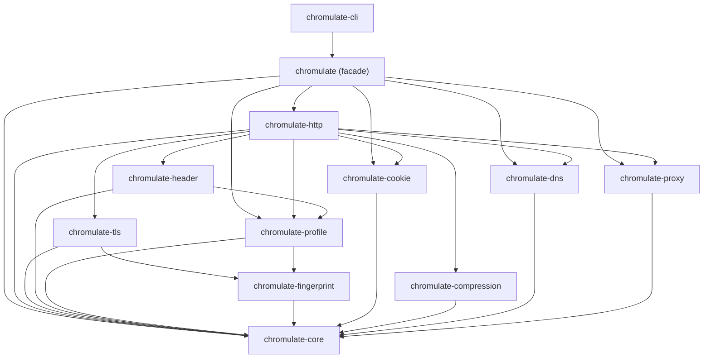
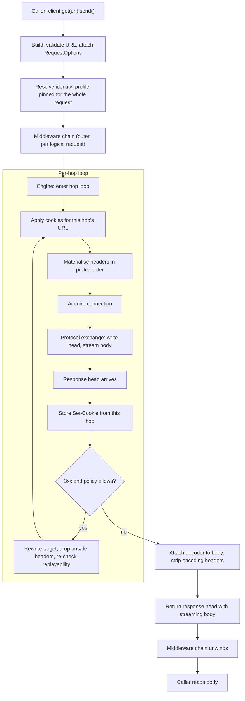
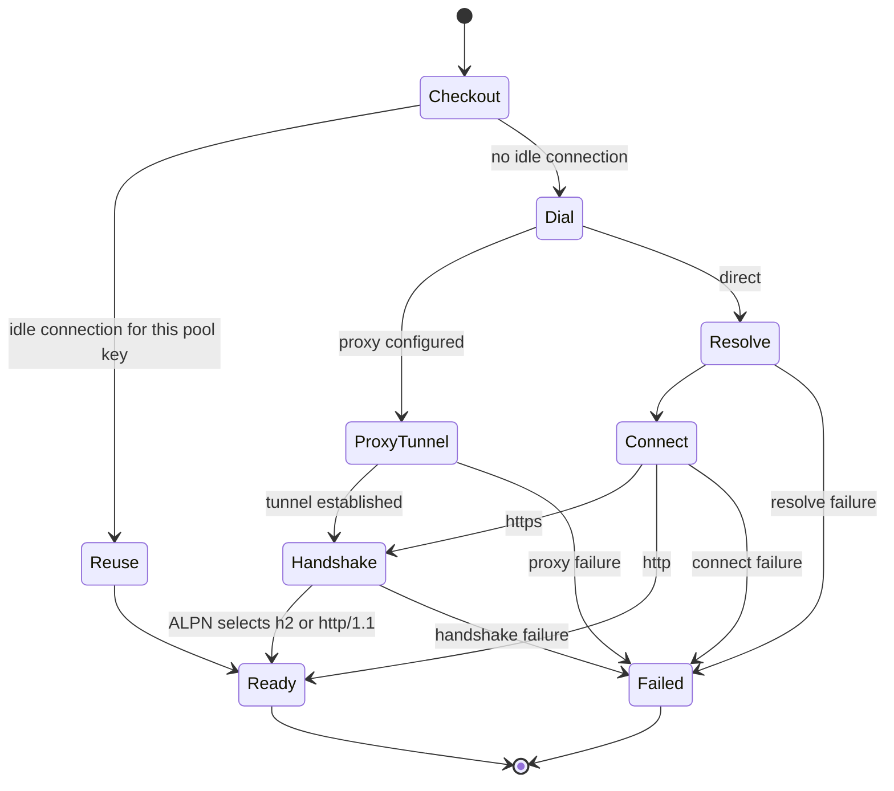

# Chromulate: Engineering Specification

Status: working specification for implementation. Revision of 2026-08-04.

This document specifies the architecture of Chromulate, a browser-grade networking engine
written in Rust. It is written for the engineers who will implement it and for the
reviewers who will decide whether the design is sound. Its companion,
[`01-browser-networking-reference.md`](01-browser-networking-reference.md), describes how
a browser performs a network request; this document describes how Chromulate reproduces
that observable behaviour. The delivery plan is in
[`03-roadmap.md`](03-roadmap.md).

Two conventions run through the whole document. Claims about the codebase carry a
`path:line` citation and were checked against the file at the cited line. Claims about
performance are labelled **UNMEASURED** where no benchmark has settled them, because
inventing numbers would make the rest of the document untrustworthy.

This document was written before any benchmark existed, so it once carried that label
without exception. A harness exists now, and where a measurement has replaced a prediction
the number lives in [`../performance.md`](../performance.md) — with the fingerprint
comparison in [`../fidelity.md`](../fidelity.md) — rather than being copied here, so there
is one place for a reader to check whether a figure is current. The `UNMEASURED` labels
that remain below are the ones still genuinely open.

---

## Table of contents

1. [Philosophy and non-goals](#1-philosophy-and-non-goals)
2. [Crate topology](#2-crate-topology)
3. [The type-level architecture](#3-the-type-level-architecture)
4. [The request pipeline](#4-the-request-pipeline)
5. [The identity engine](#5-the-identity-engine)
6. [Profile evolution](#6-profile-evolution)
7. [Connection management](#7-connection-management)
8. [The TLS story, told honestly](#8-the-tls-story-told-honestly)
9. [Extensibility](#9-extensibility)
10. [Performance model](#10-performance-model)
11. [Error handling](#11-error-handling)
12. [Testing strategy](#12-testing-strategy)
13. [Security and scope](#13-security-and-scope)
14. [Engineering review](#14-engineering-review)
15. [Open questions](#15-open-questions)

## Quick answers

The questions this document gets asked most, and where each is answered. The one-line
answers are summaries, not substitutes — every one of them has a reason attached, and the
reason is usually the useful part.

| Question | Short answer | Section |
|---|---|---|
| How many layers is the engine? | Five on the request path: facade → middleware chain → retry → redirect loop → per-hop exchange, over a transport stack of pool → connector → TLS/proxy/DNS. | [4.2](#42-the-pipeline), [4.3](#43-what-each-stage-owns) |
| Where are traits used? | At the extension points only: `Exchange`, `Middleware`/`Next`, `CookieStore`, `Resolve`, `ProxyProvider`, `Clock`. Everything else is concrete. | [3.4](#34-why-the-extension-traits-return-boxed-futures), [9](#9-extensibility) |
| What do the async boundaries look like? | `BoxFuture` at each trait boundary, because async fn in traits is not object-safe; one boxed future per extension point per request. | [3.4](#34-why-the-extension-traits-return-boxed-futures) |
| Is cancellation safe? | Yes, and structurally: dropping the response future drops the whole tree; there is no token to forget to check. A body dropped early takes its connection with it rather than pooling a socket at an unknown read position. | [4.4](#44-cancellation-and-deadlines), [7.4](#74-lifecycle-limits-and-eviction) |
| Is there a Tower-like middleware layer? | Yes in shape, no in type: `Middleware` + `Next`, not `tower::Service`. Retry deliberately sits below the chain rather than in it. | [9.2](#92-middleware) |
| What is the pool's ownership model? | HTTP/1.1 is exclusive and returns through the response body; HTTP/2 is shared and is registered when opened. Two protocols, two doors. | [7.4](#74-lifecycle-limits-and-eviction) |
| How is backpressure applied? | Flow control and consumer polling bound bytes. Nothing bounds concurrent requests or open sockets — that is the caller's job, and the table says so explicitly. | [10.4](#104-backpressure-and-streaming) |
| What is the task spawn strategy? | One driver task per connection, one per DNS resolution, none per request. | [10.3.1](#1031-task-spawning) |
| How does lock contention behave under real load? | One mutex for the pool, measured flat to 100 origins at parity with `reqwest`; the sweep that used to make it bind is fixed and the fix is measured. | [10.3](#103-locks) |
| Is there unsafe code? | None in any shipped crate — `forbid(unsafe_code)` throughout. One exception in `chromulate-bench`, which is `publish = false`: a counting global allocator cannot be written without it. | [3.3](#33-ownership-borrowing-and-the-cost-of-forbidding-unsafe) |

For what a server actually observes — TLS, HTTP/2 and header fidelity — see
[`../fidelity.md`](../fidelity.md). For measured performance, [`../performance.md`](../performance.md).

---

## 1. Philosophy and non-goals

### 1.1 What Chromulate is

Chromulate is an HTTP client whose observable network behaviour is derived from a captured
browser profile rather than from the library author's preferences. A caller selects a
profile; every network-visible property follows from it automatically. The TLS shape, the
HTTP/2 settings, the header set and its order, the client hints, the advertised content
codings and the language list all come from the same source, so they agree with one
another by construction.

That single sentence is the entire product. Everything else in this document is a
consequence of taking it seriously.

The reason a library like this needs to exist is that the alternatives sit at two
extremes. A general-purpose HTTP client is small and fast, but its wire behaviour reflects
its own dependency stack: whichever TLS library it links, in whichever default
configuration, with headers in whatever order the hash map iterated. A headless browser
reproduces browser behaviour perfectly, because it *is* a browser, and pays for it with
hundreds of megabytes of resident memory and a process tree per tab. Chromulate occupies
the space between: the memory profile of a native client, with the wire behaviour treated
as a specified, tested output rather than an accident of the build.

### 1.2 What Chromulate is not

It is not a browser. There is no JavaScript engine, no DOM, no layout, no rendering, no
Chromium, no V8, and none of these will be added. A page that only reveals its content
after script execution is not a page Chromulate can fetch, and that is a permanent
property of the design, not a gap in the roadmap.

It is not a browser automation framework. There are no pages, no selectors, no clicks. If
you need to interact with a page, use a browser automation tool. Chromulate is the layer
such a tool would sit above if it only needed the network.

It is not a Chromium port. No Chromium source was read into this design, and none of its
internal structure is reproduced. Where this document arrives at a similar answer to a
browser, it is because both are solving the same problem against the same RFCs, and the
similarity stops at the observable behaviour.

It is not a tool for defeating security controls, and this shapes the API in ways worth
stating plainly rather than as a disclaimer. Fidelity to a captured browser is a testable
property: you can compute a fingerprint from a profile, compare it to a capture, and get a
verdict. Undetectability is not a testable property, because it is a claim about a third
party's classifier that no test in this repository can evaluate. Chromulate therefore
optimises for the property it can verify. There is no "stealth mode" flag, no randomisation
knob aimed at a particular vendor's heuristics, and no feature whose only justification is
that some classifier currently fails to notice it.

### 1.3 The design commitments

Six commitments constrain every decision that follows, and each is argued where it first
bites rather than here. Coherence over configurability: the library refuses to make it
convenient to assemble an identity no real browser produces (section 5). Captured, never
invented: every fingerprint constant traces to an observed capture with recorded
provenance, a project rule (`CLAUDE.md:30-35`) that the profile loader enforces by
rejecting a profile without one. Honest capability reporting: where the implementation
cannot reach the target shape, the documentation says so in the same place it describes the
target (section 8). Streaming by default: buffering happens when a caller asks for it, with
a limit, never as a side effect. Typed errors: no stringly-typed failure classification in
any public signature. And no `unsafe` — `unsafe_code = "forbid"` workspace-wide
(`Cargo.toml:91`), which has real costs, discussed in section 3.3 and priced in section 14.

---

## 2. Crate topology

### 2.1 The graph

The workspace declares fifteen members (`Cargo.toml:3-19`): the fourteen published crates
drawn below, plus `chromulate-bench`, which is `publish = false` and sits outside the graph
because it depends on the others only in order to measure them. Dependencies point downward
only; there are no cycles.



Three properties of this graph matter more than the individual edges.

`chromulate-core` is a sink with no internal dependencies and no I/O
(`crates/chromulate-core/src/lib.rs:1-6`). Everything else can be compiled, tested and
replaced against it independently.

The identity crates (`fingerprint`, `profile`) sit on one side of the graph and the
transport crates (`dns`, `proxy`, `tls`, `compression`) on the other, meeting only in
`chromulate-http`. A change to how a JA4 string is computed cannot break the proxy code,
because there is no path between them.

`chromulate-http` is the only crate with a wide dependency fan-in. That is deliberate and
is the subject of section 2.3.

### 2.2 Why each crate exists

**`chromulate-core`** defines the vocabulary the other crates agree on: the error
hierarchy, the streaming body, the per-request browser fetch context, and the traits third
parties implement. It contains no I/O by design
(`crates/chromulate-core/src/lib.rs:3-6`). If it were merged into `chromulate-http`, every
plugin author would depend on the HTTP engine — including the engine's `tokio` runtime and
its TLS stack — in order to implement a twenty-line cookie store. The trait definitions
would then be versioned with the engine, so any engine change would ripple through the
plugin ecosystem. Keeping core small and stable is what makes the plugin surface cheap to
depend on. This crate is written and its tests pass.

**`chromulate-fingerprint`** is the fingerprint algebra: models for a ClientHello and an
HTTP/2 connection preface, and the JA3, JA4 and Akamai computations over them. It contains
no browser data at all. Merging it into `chromulate-profile` would collapse the only
independent check the project has: the profile's constants are validated by computing a
fingerprint from them and comparing against a capture, and that check is only meaningful
while the computation and the constants are separate units with separate tests. It also
has standalone value — a user analysing their own captures needs the algebra without the
shipped Chrome data.

**`chromulate-profile`** holds concrete browser identities: the Chrome profile populated
from the capture, the registry that resolves a name to a profile, and the loader for
user-supplied captures. It is inert data plus lookup. Merging it into `chromulate-header`
would force it to depend on `http::HeaderMap` and on per-request context, which would make
it impossible to use a profile as a pure value — for a fingerprint report, a diff against a
new capture, or a CLI listing.

**`chromulate-header`** turns a profile plus a request context into an ordered header list.
This is where `Sec-Fetch-Site` is computed from the initiator origin, where client hints
are selected, where `Accept` is chosen per destination, and where the profile's header
order is applied. It is separate from `chromulate-http` because header construction is
pure and exhaustively testable without a socket, and because the ordering logic is subtle
enough to deserve its own test suite. Merging it into the HTTP engine would bury a pure
function inside an I/O crate and make its tests slower and less direct.

**`chromulate-cookie`** implements `chromulate_core::CookieStore`
(`crates/chromulate-core/src/traits.rs:73-85`) as a browser-grade jar: domain and path
matching, `SameSite`, secure-context rules, the lenient date parser real browsers use, and
per-domain eviction. It depends only on core, so a user who wants Chromulate's cookie
semantics inside a different HTTP client can take just this crate. Merging it into the
engine would make that impossible and would put a `RwLock`-backed data structure with
tricky RFC 6265 semantics in the same crate as the connection pool, where a test failure
would be ambiguous between the two.

**`chromulate-compression`** provides the content codings a browser advertises and the
streaming decoders for them, along with the expansion guard that stops a small compressed
response from becoming a large decompressed one. Its default `Accept-Encoding` value is
part of the observable identity, which is why it is a first-class crate rather than a
module: the ordering of `gzip, deflate, br, zstd` is captured data
(`crates/chromulate-fingerprint/tests/data/chrome-151-macos.json:152`), not a preference.

**`chromulate-dns`** implements `chromulate_core::Resolve`
(`crates/chromulate-core/src/traits.rs:67-70`) with a system resolver, a static resolver
for tests, a caching layer, and single-flight collapsing of concurrent lookups. The
single-flight behaviour is the main reason it is not just a call to `lookup_host`: a
crawler that starts five hundred tasks against one domain should issue one DNS query.
Separating it from the engine keeps that logic testable with a counting fake and no
network.

**`chromulate-proxy`** parses proxy URLs, applies `no_proxy` rules, and performs the HTTP
`CONNECT` and SOCKS5 handshakes, returning a connected stream. It deliberately does not
depend on `chromulate-tls`: it hands back a tunnelled TCP stream and the caller wraps it.
That direction matters. If proxy depended on TLS, then `https://` proxies and TLS-over-
proxy would tangle into one type, and the crate could no longer be used to tunnel anything
that is not HTTPS.

**`chromulate-tls`** translates a `ClientHelloSpec` into a rustls client configuration and
performs the handshake. It depends on `chromulate-fingerprint` for the spec but not on
`chromulate-profile`, because it needs the shape, not the browser identity that produced
it. Merging it into `chromulate-http` would mean that anyone wanting a browser-shaped TLS
connection for something other than HTTP — a WebSocket over raw TLS, a protocol
measurement tool — would have to pull in the connection pool and the HTTP state machines.

**`chromulate-http`** owns the connection pool, the HTTP/1.1 and HTTP/2 exchanges, the
redirect loop, and the terminal `Exchange` implementation
(`crates/chromulate-core/src/traits.rs:89-92`). It is the widest crate in the workspace and
section 2.3 argues that it should be.

**`chromulate`** is the facade: `Client`, its builder, and the ergonomic request API. It
re-exports what a normal user needs so that a typical `Cargo.toml` has one Chromulate
dependency. It also hosts the built-in middleware (retry, rate limiting, tracing) behind
feature flags, because those need no privileged access to engine internals — they are
ordinary `Middleware` implementations, and shipping them in the facade proves the plugin
surface is sufficient.

**`chromulate-cli`** is a binary for the workflows that need a command line rather than a
program. Four subcommands ship (`crates/chromulate-cli/src/main.rs:38-53`): `get` fetches a
URL with a chosen profile, `fingerprint` prints the fingerprint a profile targets,
`profiles` lists what the build ships, and `verify` rebuilds every shipped profile from its
capture and reports drift. Section 6.4 explains why the last of these is load-bearing for
the project's maintenance story rather than a convenience.

### 2.3 Deviations from the suggested crate layout

`docs/prompts/prompt-1.md:311-343` sketches a larger set of crates. Seven of them are not in the
implemented roster. Each omission is a decision, not an oversight.

**`chromulate-http2` — merged into `chromulate-http`.** HTTP/1.1 and HTTP/2 share the
connection pool. Which protocol a connection speaks is decided by ALPN during the TLS
handshake, so a single pooled entry may turn out to be either, and the pool must hold both
kinds under one key and hand back whichever the connection negotiated. Splitting HTTP/2
into its own crate would require exporting the pool's internals across a crate boundary:
the pooled-connection type, the checkout and return protocol, the idle timer, the
`GOAWAY` handling. Those would become public API and therefore semver-frozen, which would
make the pool — the part of the engine most likely to need redesign under load — the part
hardest to change. The cost of merging is a larger crate with a longer compile time. The
cost of splitting is a permanent public commitment to today's pool design. We take the
compile time.

**`chromulate-h3` — the crate exists; the QUIC transport does not ship.**
It holds RFC 7838 `Alt-Svc` parsing and an alternative-service cache, which is how a client
learns an origin offers HTTP/3, plus a QUIC spike behind the non-default `quic-spike`
feature. The spike completes a real HTTP/3 request and exists to measure what the
`quinn`/`h3` stack puts on the wire, not to serve traffic. Nothing in the workspace depends
on the crate yet. Why the transport is not shipped — the handshake cannot be shaped and
there is no Chrome-over-QUIC capture to measure it against — is in
[`04-http3-assessment.md`](04-http3-assessment.md).

**`chromulate-cache` — shipped behind `chromulate-http`'s off-by-default `cache` feature.**
An RFC 9111 response cache: storability, freshness, the §4.2.3 age correction,
`ETag`/`Last-Modified` revalidation with `304` field merging, `Vary` selection, and
invalidation on unsafe methods. What it deliberately omits — stale-while-revalidate,
stale-if-error, shared-cache semantics, ranges, `HEAD`, persistence — is listed in the
crate's own documentation. It is a feature rather than a default because a cache is state
a caller should opt into, and because a wrong cache is worse than none.

**`chromulate-auth` — not a crate.** HTTP authentication decomposes into two unrelated
things. Proxy authentication is part of the tunnel handshake and belongs in
`chromulate-proxy`, where credentials are already handled and redacted. Origin
authentication — `Authorization` headers, bearer tokens, challenge-response loops — is
header manipulation with retry, which is what middleware is for.

**`chromulate-session` — not a crate.** "Session" names three things that already have
owners: cookie persistence is `chromulate-cookie`, which exposes an exportable snapshot;
connection reuse is the pool in `chromulate-http`; a stable identity across requests is the
`Client` itself, which holds one profile for its lifetime. There is no residue. A session
crate would be a facade over three subsystems whose main effect would be to give people a
natural place to put shared mutable state.

**`chromulate-middleware` — the trait lives in core.** Everything depends on the middleware
trait: the engine runs the chain, the facade builds it, and every plugin implements it. If
it lived in a separate crate, that crate would be a dependency of core's dependents and of
core's consumers alike, and would become a second core with all the version-coupling that
implies. The concrete middlewares do not need a crate either — they live in the facade
behind feature flags, which has the useful side effect that the built-in middleware is
written against exactly the public API a third party has.

**`chromulate-metrics` — `tracing` plus a middleware.** `tracing` is already a workspace
dependency (`Cargo.toml:61`). A metrics crate would either wrap OpenTelemetry, forcing a
fast-moving dependency on every user, or reimplement what `tracing` already does. The
design instead commits to emitting spans with stable names and stable field names — that
stability is the actual contract — and leaves the bridge to the user's telemetry stack.
Section 9.7 specifies the span vocabulary.

---

## 3. The type-level architecture

This section describes the types in `chromulate-core` as they exist. The crate is written,
compiles, and its tests pass; every claim here is against the file on disk.

### 3.1 The error hierarchy

`Error` (`crates/chromulate-core/src/error.rs:63-179`) is a flat, non-exhaustive enum of
seventeen variants. Flat rather than nested, because the questions callers actually ask are
cross-cutting: *which phase failed*, *is it worth retrying*, and *whose fault is it*. A
nested hierarchy would force a caller to match two levels deep to answer a question that
spans branches.

Those three questions are answered by methods rather than by structure:

- `phase()` (`error.rs:248-261`) returns the lifecycle stage, using the `Phase` enum
  (`error.rs:22-37`) that also labels timeouts.
- `is_retryable()` (`error.rs:208-221`) is deliberately conservative. It reports `true`
  only for failures that happened before the origin could have processed the request, or
  for transport faults known to be transient.
- `is_user_error()` (`error.rs:240-245`) separates caller mistakes from network faults, so
  a CLI can print a message instead of a stack trace.

Two details in `is_retryable` are worth calling out because they encode real reasoning
rather than a default. A TLS failure is *not* retryable (`error.rs:211`): a handshake that
fails usually fails for a structural reason — an untrusted chain, a version mismatch, a
mis-set SNI — and retrying converts a clear error into a slow one. And a body error is
never retryable (`error.rs:222`), in any phase. On receive, bytes may already have reached
the caller, so replaying would produce a torn result. On send, writing had already begun, so
the origin may hold a complete request and replaying would duplicate its side effect. Only
the engine knows whether a single byte actually left the socket, and it reports that case as
`Connect` instead. An earlier version made `Phase::Send` retryable, which — combined with the
`try_clone` defect described in §4.3 — produced silently empty replayed `POST`s.

There is no variant for an HTTP error status. A 404 or a 503 is a response, not an error,
and it is returned as `Ok`. This is not a stylistic choice; it is what makes middleware
composable, because a middleware that wants to see failed responses does not have to
un-wrap an error to find them.

The enum is `#[non_exhaustive]` (`error.rs:62`), so new variants are not breaking changes.
That matters given that six crates are still being written against it.

### 3.2 The body model

`Body` (`crates/chromulate-core/src/body.rs:31-33`) wraps a private three-variant enum
(`body.rs:21-28`): `Empty`, `Fixed(Option<Bytes>)`, and `Stream { stream, length }`.

The three shapes exist to keep the common cases allocation-free. An empty body carries no
state and is `const`-constructible (`body.rs:40-44`). A fixed body hands out a single
reference-counted `Bytes` chunk. Only a genuinely streaming body pays for a boxed, pinned
stream (`body.rs:19`). A design with one always-boxed variant would be simpler and would
put a heap allocation on the path of every `GET`, which is the most common request there
is.

Three behaviours of this type are load-bearing elsewhere in the engine.

`try_clone()` (`body.rs:98`) returns `Some` for an empty body and for a fixed body that
still holds its bytes, and `None` for a stream **and for a fixed body whose chunk has
already gone to the transport**. The redirect loop and the retry middleware call this to
decide whether a request can be re-sent at all. Making replayability a property of the body
— visible, checkable, and impossible to get wrong by assumption — is better than a boolean
flag someone has to remember to set.

That last case is not a detail. An earlier version returned `Some` of an *empty* body for a
drained fixed body, and every downstream signal agreed with the lie: `is_empty()` was true,
`content_length()` was `Some(0)`. A retry that trusted it re-sent the `POST` with no payload
and `Content-Length: 0`. A review pass caught it; the regression test
`a_drained_fixed_body_is_not_replayable` pins the corrected behaviour.

`collect(limit)` (`body.rs:112-146`) enforces the limit *while* streaming, so an oversized
response is abandoned rather than buffered and then rejected. Enforcing after the fact
would make the limit useless as a memory bound, which is its only purpose.

`content_length()` (`body.rs:83-89`) distinguishes "known to be zero" from "unknown". An
empty body reports `Some(0)`; a stream without a declared length reports `None`, which is
what tells the HTTP/1.1 writer to use chunked transfer encoding.

`Body` implements `http_body::Body` (`body.rs:199-236`), so it interoperates with hyper and
the wider ecosystem without an adapter.

### 3.3 Ownership, borrowing, and the cost of forbidding `unsafe`

The request path is built on ownership. A `Request` is `http::Request<Body>`
(`crates/chromulate-core/src/request.rs:16`), owned, and moved through the middleware chain
by value (`traits.rs:156`). Nothing on the hot path is shared behind a lock that does not
have to be.

Where sharing is unavoidable, it is explicit. `Next` borrows the middleware slice and the
terminal exchange rather than cloning them (`traits.rs:109-112`), so building the chain for a
request costs two pointers, not a `Vec` clone. `HostPort` stores its host as `Arc<str>`
(`traits.rs:29`) rather than `String`, because a resolution target is cloned into cache
keys, pool keys and log fields far more often than it is constructed.

`forbid(unsafe_code)` (`Cargo.toml:91`) has a concrete, visible cost in this codebase, and
the design pays it deliberately rather than pretending it is free. The idiomatic way to
implement a streaming body in async Rust is `pin-project-lite`, whose expansion contains
`unsafe`. Forbidding it means streams must be boxed and pinned at construction. `Body` does
exactly this (`body.rs:19`, `body.rs:67`), and the comment at `body.rs:207-208` records the
consequence: because a `Pin<Box<...>>` is itself `Unpin`, the body can be projected with
`self.get_mut()` and no projection machinery at all. The cost is one allocation per
streaming body — not per chunk. The benefit is that the entire workspace can be audited for
memory-safety reasoning in the time it takes to read a lint configuration. For a library
whose users point it at untrusted input by definition, that is a good trade, and it is the
trade the project has already made.

### 3.4 Why the extension traits return boxed futures

Every trait in `crates/chromulate-core/src/traits.rs` returns
`BoxFuture<'a, T>` = `Pin<Box<dyn Future<Output = T> + Send + 'a>>` (`traits.rs:24`) rather
than using `async fn` in trait position. The crate documents the reasoning at
`traits.rs:4-7`, and it is worth expanding, because this is the single most questionable-
looking decision in core and it was made on purpose.

Async functions in traits are stable in Rust 2024, but they do not produce object-safe
traits without an adapter: the returned future's type is per-implementation, so
`dyn Middleware` is not expressible. Chromulate needs `dyn`. The middleware chain is a
`&[Arc<dyn Middleware>]` (`traits.rs:110`) whose length and contents are decided at runtime
by a builder. A resolver, a cookie store and a proxy provider are each selected at runtime
and stored behind a trait object. Making these generic instead would push type parameters
through `Client`, through the pool, and into every user signature that mentions a client —
the classic case where a zero-cost abstraction is only zero-cost if you never need
heterogeneity, and here heterogeneity is the requirement.

The cost is precise and small: one heap allocation per call at the extension boundary, plus
a virtual call, plus the loss of cross-boundary inlining. Per request that means one
allocation per middleware in the chain, one for the resolve call when it is not cached, and
one for the terminal exchange. On a request that performs a DNS lookup, a TCP connect and a
TLS handshake, these allocations are not the thing to worry about. **The relative cost is
UNMEASURED**; the benchmark that would settle it is a chain-depth sweep against a local
server, specified in section 12.5.

The alternative that was rejected: generic middleware composed at compile time, in the
Tower style, where the chain's type encodes its shape. It produces better code and a worse
API — the chain's type must be named or boxed at the top anyway to store it in a `Client`,
which reintroduces the allocation at the outermost layer while making every intermediate
signature harder to write. Tower itself boxes in practice for the same reason.

### 3.5 Per-request context

`RequestOptions` (`request.rs:122-144`) carries the browser fetch context that a caller
never states explicitly but that a browser always knows: whether this is a navigation
(`mode`, `dest`), which document initiated it (`initiator`), what the referrer should be
derived from (`referrer`), and the per-request deadlines and redirect policy.

It travels inside `http::Extensions` (`request.rs:118-119`, with a round-trip test at
`request.rs:282-294`) rather than being a field of a bespoke request struct. This keeps
`Request` a plain `http::Request<Body>`, which means every function in the ecosystem that
accepts an `http::Request` accepts a Chromulate request. A middleware author who wants to
inspect the fetch context reaches into extensions; one who does not care never learns it
exists.

`FetchMode` and `FetchDest` (`request.rs:24-36`, `request.rs:54-70`) are enums with
`as_str` methods returning the exact wire tokens. The header engine does not format these
values; it reads them. That is the difference between a header whose value is a specified
output and one that is a string literal somewhere in an I/O crate.

---

## 4. The request pipeline

### 4.1 The straw man, and what is wrong with it

`docs/prompts/prompt-3.md:195-233` sketches a linear pipeline: Request, Identity, Headers, TLS,
Connection Pool, HTTP, Response Processing, Cookie Update, Cache, Application. It is a
reasonable first sketch and it is wrong in five ways that matter.

*TLS is placed before the connection pool.* In a working client the pool owns the
connection and TLS is part of establishing a *new* one; on a pool hit there is no TLS step
at all. Drawing TLS as an unconditional stage suggests a handshake per request, which is
the single largest cost the pool exists to avoid.

*There is no resolution or proxy stage.* Both change behaviour observably — a `socks5h`
proxy resolves the hostname at the proxy, which changes who sees the DNS query — and both
fail in ways the error model already distinguishes (`Error::Resolve`, `Error::Proxy`).

*There is no redirect loop.* A redirect is not a stage; it is a jump backwards. Stages from
cookie application to response head repeat per hop with a different URL each time, so
cookies, `Sec-Fetch-Site` and the referrer must all be recomputed per hop. A linear diagram
hides the one part of the pipeline where per-hop and per-request state get confused.

*Cookie update is placed after response processing.* Cookies arrive in the response head
and must be stored then, not when the body finishes. Storing after the body would mean a
redirect could not carry the cookie the redirect response just set, and a streaming
download would delay its own `Set-Cookie` for as long as the stream lasts.

*It has no place for middleware and no distinction between per-request and per-hop work.*
This is the deepest problem. Identity resolution happens once per logical request; header
materialisation happens once per hop. Conflating them is how a client ends up changing its
user agent halfway through a redirect chain.

### 4.2 The pipeline

Chromulate's pipeline is two nested loops. The outer layer runs once per logical request
and is where middleware lives. The inner layer runs once per hop and is where the network
happens.



Connection acquisition is itself a state machine, and it is where the pool hit or miss is
decided:



The four failure edges correspond one to one with `Error::Resolve`, `Error::Connect`,
`Error::Proxy` and `Error::Tls`; section 11.1 maps every stage to the variants it can
produce.

### 4.3 What each stage owns

**Build** validates the URL and attaches `RequestOptions`. Failures here are
`Error::Builder` or `Error::Url` and are attributed to the caller
(`error.rs:240-245`). No I/O has happened, so nothing needs cleaning up.

**Identity resolution** happens exactly once and the result is pinned for the entire
request including all redirect hops. A browser does not change its user agent when it
follows a redirect, and neither does Chromulate. The resolved identity is an immutable
value shared by reference through the hop loop.

**Middleware** runs outside the hop loop, so a chain sees one logical request even when the
engine follows several hops to satisfy it (`traits.rs:149-150`). This is a deliberate
choice with a visible consequence: a retry middleware retries the whole chain from the
original URL, and a logging middleware logs one line per request rather than one per hop.
A middleware that genuinely needs per-hop visibility is not served by this design, and
section 15 records that as an open question.

**Cookie application** is per hop, against that hop's URL, because a redirect to a
different host must send that host's cookies and not the previous host's.

**Header materialisation** is per hop and produces an ordered list, not a `HeaderMap`. The
reason is specific and easy to get wrong: `http::HeaderMap` iterates in an arbitrary order
that the crate explicitly declines to guarantee (http 1.5.0, `src/header/map.rs:914`, with
`src/header/map.rs:39-41` noting that iteration-order changes are not breaking changes). A
header engine that builds a `HeaderMap` and lets the serialiser iterate it will produce a
header order that is stable per `http` version and unrelated to any browser. Chromulate
therefore carries the order explicitly from the profile
(`chrome-151-macos.json:129-142` records the captured navigation order) and the HTTP layer
must serialise according to it. Section 8.5 covers how far this can actually be taken with
the current HTTP stack.

**Connection acquisition** consults the pool by key (section 7) and only dials on a miss.

**Protocol exchange** writes the head and streams the body. The request body is not
buffered; the response body is not buffered.

**Head processing** stores cookies, decides the redirect, and attaches the decompression
wrapper. All three happen on the head, before any body byte is delivered, which is what
makes streaming work end to end.

**Redirect** rewrites the target and re-enters the loop. Three rules apply. The body must
be replayable or the redirect fails — `Body::try_clone` (`body.rs:98-106`) decides this. A
cross-origin redirect drops `Authorization`, `Cookie` and `Proxy-Authorization`, because
carrying them across an origin boundary is a credential leak. And a 303, or a 301/302 on a
`POST`, becomes a `GET` with no body, matching the Fetch specification and every browser.
The limit is `RedirectPolicy::DEFAULT_LIMIT`, twenty (`request.rs:105`), with the reasoning
for that number recorded at `request.rs:103-104`.

### 4.4 Cancellation and deadlines

Two deadlines exist because they answer different questions.
`RequestOptions::head_timeout` (`request.rs:131`) bounds the time to a response head and is
the one that detects an unresponsive origin. `RequestOptions::timeout` (`request.rs:124`)
bounds the whole request including redirects and body, and is the one that bounds resource
use. A single timeout cannot do both: setting it tight enough to detect a dead server makes
it too tight for a large download.

That difference decides which of them is on by default. `head_timeout` defaults to thirty
seconds, in both `EngineConfig::new` and `ClientBuilder::new` — the builder overwrites the
engine's value wholesale, so a default set in only one of them would be invisible. The
whole-request `timeout` defaults to `None`, because a large download, a streamed response
and an SSE stream all legitimately run long and no default distinguishes one of those from
a hang. Long polling is the case where even the head wait is wrong, since there the silence
is the protocol; `ClientBuilder::no_head_timeout` exists for it.

Cancellation is structural rather than cooperative. Dropping the response future drops the
body, which drops the stream, which returns the connection to the pool or closes it. There
is no cancellation token to forget to check. The requirement this places on the
implementation is that every stage must be drop-safe — in particular, a connection dropped
mid-body must not be returned to the pool as reusable, because its read position is
unknown. Section 7.4 makes that a pool invariant.

---

## 5. The identity engine

This is the heart of the project. Everything else is a delivery mechanism for it.

### 5.1 The problem it solves

A request has many independently-settable network-visible properties: the cipher list, the
extension set, the supported groups, the ALPN list, the HTTP/2 settings and their order,
the pseudo-header order, the header set, the header order, the user agent, the client hint
brands, the platform, the `Accept` value, the language list, the content codings. A
conventional HTTP client lets a user set some of these and derives the rest from its
dependency stack.

The result is combinations that no real browser produces. A Chrome 151 user agent over a
default rustls ClientHello. A Chrome brand list with a Firefox header order. HTTP/2
settings in ascending numeric order because that is what the library emits, paired with a
user agent claiming a browser that sends a different set entirely.

Calling this "detectable" undersells it. It is *wrong* in the ordinary engineering sense:
the client is claiming to be something it is not, and every downstream consequence —
content negotiation, protocol selection, compression, the server's own compatibility
workarounds — is being decided from a false premise. A server that serves different markup
to Chrome than to a generic client will serve Chrome's markup to something that then fails
to behave like Chrome.

So the design goal is not "look like Chrome". It is: **make it structurally difficult to
produce an identity that no real browser produces.**

### 5.2 The data model

A `Profile` is one value describing one browser build on one platform. It is constructed
from one capture and is never assembled from parts of several.

```
Profile
├── metadata
│   ├── id                  chrome-stable-151-macos
│   ├── family, channel, version, platform
│   └── provenance          browser build, platform, endpoint, method, captured_at
├── tls: ClientHelloSpec
│   ├── cipher_suites       wire order, GREASE positions marked
│   ├── extensions          the SET, plus an ExtensionOrder policy
│   ├── supported_groups, key_share_groups
│   ├── signature_algorithms, alpn, alps
│   └── certificate_compression, psk_modes, ec_point_formats
├── http2: Http2Spec
│   ├── settings            ordered list
│   ├── connection_window_update_increment
│   ├── headers_frame_priority
│   └── pseudo_header_order
├── headers: HeaderProfile
│   ├── user_agent, client_hint_brands, platform, mobile
│   ├── accept              per FetchDest
│   ├── accept_language, accept_encoding
│   └── order               navigation order, subresource order
└── behaviour
    └── redirect limit, connection window, priority hints
```

Every field of the Chrome profile traces to a field of
`crates/chromulate-fingerprint/tests/data/chrome-151-macos.json`. The cipher order comes
from `chrome-151-macos.json:42-59`, the extension set from `:78-83`, the supported groups
from `:84-85`, the ALPN list from `:98`, the HTTP/2 settings from `:120-125`, the
pseudo-header order from `:127`, the header order from `:129-142`, and the header values
from `:143-155`.

### 5.3 Coherence is a type-level property

The API makes one profile the unit of selection:

```rust
let client = Client::builder()
    .profile(Profile::chrome_stable())
    .build()?;
```

**Specified, not built.** The rest of this section describes a derivation API that was
designed and has not been written, and it is kept because the reasoning still governs what
gets built next. What exists today is stated first, so the two are not confused.

Overriding a captured value goes through the client builder, not through the profile.
`ClientBuilder::user_agent` (`crates/chromulate/src/client.rs:397`) sets a default header
and says on the type what that costs: the user agent is one part of a whole that also
includes the handshake, the HTTP/2 preface and the client hint brands, so changing it alone
produces a client its own handshake contradicts. The warning is in the doc comment, where a
reader has to be looking for it. The profile itself carries no record that it happened, and
`Client::identity_report()` — the reporting half of this design — does not exist, which
`03-roadmap.md` also states.

The design that would replace that arrangement routes an override through a derivation that
records itself:

```rust
let profile = Profile::chrome_stable()
    .derive()
    .accept_language("de-DE,de;q=0.9")
    .build();
```

The derived profile's provenance would record that it is derived, from which base, and
which fields changed, and `Client::identity_report()` would print it. The point is not to
prevent overrides — users have legitimate reasons — but to make a divergence from a captured
identity a visible, recorded fact rather than an invisible one. `Profile::derive()` is not
implemented either; the coherence classes below are the specification for it.

The derivation API would distinguish fields by their **coherence class**, a property of the
field recorded in the profile model:

- **Fixed.** Changing it independently makes the identity incoherent, because the value is
  determined by the browser build. The cipher order, the extension set, the HTTP/2
  settings, the header order, the client hint brands, the user agent. `derive()` would
  expose no setters for these. Changing them means capturing a different browser.
- **Coherent.** A real instance of this same browser build could have this value. The
  language list, the platform where a capture exists for it, the timezone-adjacent hints.
  `derive()` would expose these freely, because a German Chrome 151 on macOS is a real thing.
- **Derived.** Computed from other fields and from the request. `Sec-Fetch-Site`,
  `Sec-Fetch-Mode`, `Sec-Fetch-Dest`, `Referer`, `Content-Length`. Never settable; always
  computed.

This classification is how the design's central promise was meant to be kept: it turns
"please keep your identity coherent" from a documentation request into something the type
system participates in. Until `derive()` exists, nothing in the type system distinguishes
the classes. What the builder offers instead is header-shaped overrides that carry a warning
in prose (`client.rs:384-392`), and a wholesale `ClientBuilder::tls` swap (`client.rs:450`)
for a caller who wants a different engine entirely — coarse enough that nobody reaches it by
accident, but not the recorded, reportable divergence this section asks for.

### 5.4 An identity is a distribution, not a constant

The capture contains a verified finding that shapes the whole model
(`chrome-151-macos.json:12-16`): two connections from the same browser process, minutes
apart, produced **different JA3 hashes** — `a0442bdf8e49e27cb5ee80009f29a6a2` and
`43b2a31e00f7c2151cef4cd21c7c58f7` — because Chrome permutes the ClientHello extension
order on every connection. The cipher order was identical across both, and the JA4 cipher
component was stable at `8daaf6152771` because JA4 sorts before hashing.

A profile that froze one extension order would therefore be *less* faithful than one that
models the permutation, and would be trivially distinguishable from a real browser by the
fact that it never varies. So `ClientHelloSpec` stores an extension **set** plus an
`ExtensionOrder` policy: `Fixed(Vec)` for browsers that do not shuffle, and
`Shuffled { pinned_first, pinned_last }` for Chrome, with the constraint that
`pre_shared_key` (0x0029) is always emitted last (RFC 8446 §4.2.11) encoded in the type
rather than in a comment.

The second sample also shows the extension *count* changing with session state: 16
extensions on a fresh connection, 17 when a session ticket allowed `pre_shared_key`
(`chrome-151-macos.json:29`). The identity therefore has to be resolved per connection, not
per client:

**`Profile`** (static, captured, shared by `Arc` across the client) → **`ConnectionIdentity`**
(one concrete draw: one extension permutation, one GREASE draw, PSK present or not),
materialised when a connection is established and retained for that connection's lifetime.

Retaining it for the connection's lifetime is not an optimisation. A TLS connection has
exactly one ClientHello; every request on that connection inherits it. This is the fact
that forces identity into the pool key, and section 7.2 follows it through.

### 5.5 What a profile determines

| Observable | Profile field | Consumer |
|---|---|---|
| Cipher suite list and order | `tls.cipher_suites` | `chromulate-tls` |
| Extension set and permutation policy | `tls.extensions`, `tls.order` | `chromulate-tls` |
| Supported groups, key shares | `tls.supported_groups`, `tls.key_share_groups` | `chromulate-tls` |
| Signature algorithms | `tls.signature_algorithms` | `chromulate-tls` |
| ALPN list, and therefore HTTP version | `tls.alpn` | `chromulate-tls`, pool |
| HTTP/2 SETTINGS and their order | `http2.settings` | `chromulate-http` |
| Connection window increment | `http2.connection_window_update_increment` | `chromulate-http` |
| Pseudo-header order | `http2.pseudo_header_order` | `chromulate-http` |
| Header set and order | `headers.order` | `chromulate-header` |
| `User-Agent` | `headers.user_agent` | `chromulate-header` |
| `Sec-CH-UA*` | `headers.client_hint_brands`, `platform`, `mobile` | `chromulate-header` |
| `Accept` | `headers.accept[dest]` | `chromulate-header` |
| `Accept-Language` | `headers.accept_language` | `chromulate-header` |
| `Accept-Encoding` and decoders | `headers.accept_encoding` | `chromulate-compression` |
| `Sec-Fetch-*` | derived from `RequestOptions` | `chromulate-header` |

The last row is the one that justifies `RequestOptions` existing in core. `Sec-Fetch-Site`
is computed from the initiator origin (`request.rs:139`) against the target: `none` when
there is no initiator, `same-origin` on an exact origin match using `Origin`'s normalised
comparison (`uri.rs:15-20`), `same-site` when the registrable domains match — which needs
the `psl` crate already in the workspace (`Cargo.toml:81`) — and `cross-site` otherwise.
`Sec-Fetch-Mode` and `Sec-Fetch-Dest` come straight from the enums' `as_str`
(`request.rs:40-48`, `request.rs:74-84`). The `Referer` comes from `referrer_for`
(`uri.rs:89-107`), which already implements the `strict-origin-when-cross-origin` default,
including suppression on a secure-to-insecure downgrade (`uri.rs:93-96`).

### 5.6 What the shipped Chrome profile cannot yet say

The capture is a navigation capture. It records the `Accept` value for a document
(`chrome-151-macos.json:148`) and the navigation header order (`:129-142`). It does not
record the `Accept` values Chrome sends for images, scripts, stylesheets or fonts, nor the
subresource header order, nor the `priority` values for non-document destinations — only
`u=0, i` for a document (`:154`).

Those values will therefore be **absent from the shipped profile rather than invented**.
For a subresource fetch the header engine emits what it can justify and omits what it
cannot, and the profile records the omission — which the specified but unbuilt
`Client::identity_report()` (§5.3) would surface, and which today a reader finds by
inspecting the profile.
Writing plausible values instead would violate the project's central data rule
(`CLAUDE.md:30-35`) and produce exactly the incoherent identity this section exists to
prevent, with the added problem of being invisible.

The same applies to high-entropy client hints. A browser sends `Sec-CH-UA-Arch`,
`Sec-CH-UA-Model`, `Sec-CH-UA-Platform-Version`, `Sec-CH-UA-Full-Version-List` and
`Sec-CH-UA-Bitness` only after an origin requests them with `Accept-CH`. The mechanism — an
`Accept-CH` store keyed by origin, populated from responses — belongs in
`chromulate-header`. The *values* are not in the capture, so the shipped Chrome profile
declines high-entropy hints, documented as a known divergence rather than papered over.

One more honest note. The client hint brand list in the capture
(`chrome-151-macos.json:144`) contains a deliberately fake brand,
`"Not=A?Brand";v="99"`, which browsers include as an anti-ossification measure and whose
position varies. A single capture cannot tell us the permutation policy. The profile
therefore treats the captured arrangement as fixed and records that this is an assumption
from a one-sample observation, to be revisited when a multi-sample capture exists.

---

## 6. Profile evolution

Chrome ships roughly every four weeks. A library whose value depends on matching it needs a
maintenance story that does not depend on heroics.

### 6.1 The file format

Profiles are JSON with a mandatory `schema_version` and a mandatory `provenance` block. A
profile without provenance fails to load — that is the mechanism that turns
"captured, never invented" from a rule people are asked to follow into one the loader
enforces.

```json
{
  "schema_version": 1,
  "id": "chrome-stable-151-macos",
  "provenance": {
    "browser": "Google Chrome 151.0.0.0",
    "platform": "macOS",
    "endpoint": "https://tls.peet.ws/api/all",
    "capture_method": "browser automation, two separate TLS connections",
    "captured_at": "2026-08-04"
  },
  "tls": { "...": "ClientHelloSpec" },
  "http2": { "...": "Http2Spec" },
  "headers": { "...": "HeaderProfile" }
}
```

The shipped Chrome profile is compiled in as Rust constants rather than loaded from a file
at runtime, so a binary has no runtime data dependency and a missing file cannot be a
production failure. The JSON loader exists for user-supplied captures and is the same
format, so a shipped profile and a user profile are interchangeable and the round trip is
testable.

Unknown fields are rejected on load rather than ignored. A typo in a hand-edited capture
that silently does nothing is worse than an error, because the user will believe a setting
took effect. Forward compatibility is handled by `schema_version`: a profile with a version
newer than the loader understands is rejected with a message naming the versions, rather
than partially parsed.

### 6.2 Versioning and the compatibility policy

The policy has one rule from which the rest follows: **a published profile id is immutable.**

`chrome-stable-151-macos` means, permanently, the capture taken on 2026-08-04 from Chrome
151 on macOS. When Chrome 152 ships, a new profile `chrome-stable-152-macos` is added; 151
is not edited. A user who pinned the versioned id gets reproducible behaviour for the life
of the crate. A user who wrote `Profile::chrome_stable()` — which resolves through an alias
— gets the current one and accepts that it moves.

This makes the alias a documented moving target and the id a documented fixed point, which
is the only arrangement where both kinds of user get what they need.

Consequences for semver:

| Change | Version impact |
|---|---|
| Add a new profile id | Minor |
| Move an alias to a newer profile | Minor, with a changelog entry naming both ids |
| Correct an error in an existing profile | Minor, changelog entry with the new capture's provenance and the corrected fields |
| Mark a profile deprecated | Minor |
| Remove a deprecated profile | Major |
| Change the profile schema | Major, or minor with a `schema_version` bump and both loaders retained |

Correcting an existing profile is the uncomfortable case: it technically changes observable
behaviour without a major bump. The alternative — issuing `chrome-stable-151-macos-v2` —
produces a proliferation of near-identical ids and pushes the decision onto users who have
no basis to make it. Correcting in place with an explicit changelog entry naming the
provenance of the new capture is the lesser evil, and the capture's `captured_at` field
makes the change auditable after the fact.

### 6.3 Deprecation

A profile is marked deprecated when the build it models is more than ten releases behind
current — roughly ten months. A deprecated profile still loads and still works; it emits
one `tracing::warn` per process naming the profile and the current alias target. It is
removed only at a major version. The reason for the long tail is that reproducing a
historical measurement is a legitimate use, and a library that deletes old profiles makes
old results unreproducible.

### 6.4 The refresh workflow

This is where `chromulate-cli` earns its place in the workspace. The refresh loop is three
steps. Two of them are commands someone can run today; the middle one is not built, and is
marked below rather than quietly described in the present tense.

**Capture.** A real browser is pointed at an echo endpoint and the response saved. This
step needs a browser and is therefore manual, and the documentation says so rather than
pretending a tool exists. The capture that ships today was taken this way
(`chrome-151-macos.json:3-9`).

**Diff — specified, not built.** A `diff <capture.json> <profile-id>` subcommand would
report, field by field, where a fresh capture and the shipped profile disagree, which is
what turns "Chrome 152 came out" into a reviewable change set rather than a research
project. The CLI has no such subcommand today (`crates/chromulate-cli/src/main.rs:38-53`),
so the comparison against an external capture is done by hand. This is the gap in the
maintenance story that the section's claim rests on, and it is the reason the claim is
weaker than it reads.

**Verify.** `chromulate-cli verify` rebuilds every shipped profile from the capture
compiled into the binary and compares JA3, JA4, the Akamai HTTP/2 string, the header order
and the user agent, reporting any drift and exiting non-zero. It runs in CI
(`.github/workflows/ci.yml:113`), so a change that alters a fingerprint computation and a
change that alters a profile constant both fail loudly. What it does not do is reach an
external capture — that is the `diff` step above.

Closing the loop in the other direction is now a test rather than a command. The
emitted-shape harnesses of §12.3 decode what Chromulate *actually* puts on the wire and
compare it against what the profile said it would, and the difference between those two is
the honest measure of the project's fidelity: it is written up in
[`../fidelity.md`](../fidelity.md), and section 8 exists because it is known to be
non-zero.

### 6.5 User-supplied captures

A user with a browser Chromulate does not ship can capture it and register it:

```rust
let profile = Profile::from_capture(&std::fs::read_to_string("my-firefox.json")?)?;
let mut registry = ProfileRegistry::default();
registry.register(profile)?;
```

No fork, no upstream contribution required. This is the reason the project ships only the
Chrome profile today and does not fabricate a Firefox or Safari one: no capture for them
exists in this repository, and the honest answer to "where is the Firefox profile" is
"here is the loader, and here is how to capture one", not a plausible-looking constant.

---

## 7. Connection management

### 7.1 The pool key

```
PoolKey {
    origin:   Origin,          // scheme, host, port — uri.rs:16-20
    proxy:    Option<ProxyId>, // which proxy, or direct
    identity: IdentityId,      // which resolved profile
}
```

`Origin` already provides the normalised comparison and hashing this needs
(`uri.rs:15-20`), including filling in the scheme's default port so that
`https://example.com` and `https://example.com:443` are one key (`uri.rs:32-34`, with the
round trip back out at `uri.rs:65-70` and the test at `uri.rs:117-124`).

### 7.2 Why identity is in the key

This is the most important line in the pool design, and getting it wrong would quietly
destroy the premise of the whole library.

A pooled connection carries its ClientHello and its HTTP/2 SETTINGS for its entire
lifetime. Those were chosen when the connection was established, from whichever profile the
first request used. If a second request with a different profile reuses that connection,
its bytes go out over the first profile's TLS shape and the first profile's SETTINGS. The
server sees, for example, a Chrome-shaped TLS session carrying a Safari user agent — the
exact incoherent identity that section 5 exists to prevent.

What makes this worse than an ordinary bug is that it would be *timing-dependent*. Whether
the second request hits the pool depends on whether the first connection was idle and
unexpired at that moment, which depends on load. It would work in every local test and fail
intermittently in production, and the symptom — a server behaving differently for some
fraction of requests — would be nearly impossible to trace back to the pool.

So identity is part of the key. The cost is real: a caller rotating ten profiles against
one origin maintains up to ten times the connections and gets a tenth of the reuse. That
cost is the correct one to pay, and it is also *legible* — a user can see it in the pool
metrics and reason about it — whereas the cost of the alternative is a silent correctness
failure.

The proxy is in the key for a related but simpler reason: a connection through proxy X
cannot serve a request that must go through proxy Y, because the origin sees a different
source address. For users doing proxy rotation, that is the entire point of the
configuration.

### 7.3 HTTP/2 coalescing

RFC 9113 §9.1.1 permits reusing an HTTP/2 connection for a different origin when the
presented certificate covers the new host and the host resolves to the same address.
Browsers do this and it materially reduces connection count on sites that shard across
subdomains.

Chromulate coalesces, with the identity and proxy constraints intact. The pool keeps a
secondary index from `(identity, proxy, resolved_ip)` to live HTTP/2 connections; a
checkout that misses the primary key consults it and accepts a connection whose
certificate's subject alternative names cover the requested host. A `421 Misdirected
Request` response disables coalescing for that host and connection pair and retries on a
fresh connection, because the server has told us our inference was wrong.

Coalescing never crosses an identity or a proxy boundary, for the reasons in 7.2.

### 7.4 Lifecycle, limits and eviction

Defaults as implemented in `PoolConfig::default()` (`pool.rs:239-249`) and `EngineConfig`
(`engine.rs:121`), all adjustable:

| Parameter | Default | Why |
|---|---|---|
| Idle timeout | 90 s | Long enough for a crawl's natural rhythm, short enough not to hold dead NAT bindings |
| Max idle per host | 6 | What browsers keep per origin for HTTP/1.1; HTTP/2 holds one per key regardless |
| Max total connections, per population | 100 | Bounds idle HTTP/1.1 and multiplexed HTTP/2 *separately*, so a pool may hold up to twice it. They cannot share a counter: only an idle entry can be freed, so one shared budget lets either protocol starve the other. See the note below on what it does *not* bound |
| Connect timeout | 30 s | |
| Handshake timeout | shares the connect timeout | `Error::Timeout(Phase::Handshake)` still distinguishes *where* it expired |
| Response head timeout | 30 s | Bounds a server that accepts and then goes quiet; `ClientBuilder::no_head_timeout` opts long polling out — §4.4 |
| Whole-request timeout | none | A large download or an SSE stream legitimately runs long, and no default separates one from a hang — §4.4 |
| HTTP/1.1 buffer ceiling | hyper's default | Opt-in via `PoolConfig::http1_max_buf_size`; see `docs/performance.md` |

**The caps bound idle connections, not requests in flight.** There is no semaphore on
`Engine::acquire`: a request that finds no pooled connection opens one, whatever the pool
currently holds. So 256 concurrent requests to one origin produce 256 connections, and
`max_per_host` decides how many of them are *kept* afterwards rather than how many exist at
once. This is deliberate — blocking a request behind a connection permit turns a pool
setting into a latency cliff — but it means the caps are not a file-descriptor guarantee,
and a caller that needs one has to bound its own concurrency.

Eviction happens on idle expiry, on any protocol error, and when the total cap is reached —
least-recently-used first among idle connections. A connection is also dropped rather than
pooled when the response body it carried did not finish cleanly.

`GOAWAY` is handled by the `h2` crate, which marks the sender closed; the pool discards it
at the next checkout because `Connection::is_usable` consults `is_closed`. There is no
separate `GOAWAY` path in the pool, and **no eviction on profile unregistration** — the
identity is part of the pool key, so a connection opened under one profile is simply never
matched by a request under another.

One invariant is worth stating explicitly because violating it produces a class of bug that
is very hard to diagnose: **a connection whose body stream was dropped before completion is
never returned to the pool as reusable.** Its read position is unknown, so the next request
on it would read the tail of the previous response. For HTTP/1.1 the connection is closed;
for HTTP/2 the stream is reset and the connection survives, because HTTP/2 multiplexing
makes stream state independent of connection state. This asymmetry is the main reason the
pool must know which protocol a connection speaks, and it is a second argument — after the
ALPN one in section 2.3 — for HTTP/2 living in the same crate as the pool.

**Ownership follows from that asymmetry, and the two protocols are opposites.**

An HTTP/1.1 connection is *exclusive*: `checkout` removes it from the pool, the request
owns it for the whole exchange, and it goes back only when the response body ends cleanly.
The handle travels *inside the response body* (`body.rs`, `PoolSlot`), which is what makes
the invariant above hold by construction rather than by remembering to call something: a
body that is dropped early drops the slot, and a dropped slot never releases.

An HTTP/2 connection is *shared*: it is registered with the pool when it is opened
(`Engine::acquire`) and stays there while it serves requests, because multiplexing means
"in use" and "available" are the same state. Checkout clones the sender — an mpsc handle —
rather than removing anything.

That second sentence describes the code only since the fix recorded in the changelog:
before it, nothing put a newly opened HTTP/2 connection into the pool at all, because the
h1 path returns connections through the body and the h2 path has no body to return through.
Every HTTP/2 request therefore re-did the TCP connection and the TLS handshake. It is worth
knowing as a design hazard rather than only as a fixed bug: **the two protocols enter the
pool through different doors, and adding a third transport means asking which door it uses
before assuming either.**

### 7.5 Address selection

`chromulate-dns` returns addresses in preference order, with `PreferIpv6` as the browser-
like default. **`chromulate-http` then tries them in that order, one at a time**
(`connect.rs`, `dial`): this section previously described a staggered RFC 8305 race, and
that race is not implemented. The code says so at the call site, and this paragraph now
agrees with it.

The consequence is worth stating plainly, because it is the kind of gap that sounds like a
fidelity problem and is not: a black-holed IPv6 route stalls until the connect timeout
rather than for the few hundred milliseconds a browser would take. That is a **latency**
difference, not an observable one — a server cannot see which of a client's addresses it
tried first — so it is a quality-of-implementation item rather than an identity one.

Implementing it means starting the first address, and if no connection is established
within a short delay, starting the next in parallel instead of waiting for the first to
time out. The delay would be configurable with a browser-like default in the low hundreds
of milliseconds. **Not implemented, and therefore UNMEASURED.**

---

## 8. The TLS story, told honestly

This section states what Chromulate can and cannot do today. It is deliberately the most
conservative section in the document, because a specification that overstates its own
capabilities is worse than no specification: it causes people to ship things that do not
work and to stop checking.

All rustls citations are against **rustls 0.23.43** as vendored in the local registry, the
version resolved by the workspace's `rustls = "0.23"` requirement (`Cargo.toml:71`). Paths
are relative to the crate root. All claims below were read from that source, not recalled.

### 8.1 The division of labour

`chromulate-fingerprint` models and computes the *target* shape: what the ClientHello
should contain, in what order, and what JA3 and JA4 an observer would derive from it. This
is exact, testable offline against the capture, and independent of any TLS library.

`chromulate-tls` configures rustls to get as close to that target as rustls permits. The
gap between the two is not hidden inside the TLS crate. It is computed, asserted in a test
since Phase 4 of the roadmap (`chromulate-tls/tests/emitted_client_hello.rs`), and written
up in [`../fidelity.md`](../fidelity.md). The reporting half of §5.3's design,
`Client::identity_report()`, is not built; the CLI's `fingerprint` subcommand prints the
same comparison from the profile and the provider's capabilities rather than from a
measurement.

### 8.2 What rustls can be made to do

More than the project initially assumed. Four of these were verified by reading the source
and are worth recording precisely.

**Cipher suite order is controllable.** rustls emits cipher suites in the order given by
`CryptoProvider::cipher_suites`, filtered to those usable for the protocol
(`src/client/hs.rs:370-377`), and that field is public and documented as preference-ordered
(`src/crypto/mod.rs:184-192`). Supplying a custom provider with the suites in Chrome's
captured order therefore reproduces the relative order exactly. This matters because the
capture confirms cipher order is the *stable* half of the TLS fingerprint
(`chrome-151-macos.json:13`).

**Extension order is already randomised per connection, the way Chrome does it.** This was
the most surprising finding. rustls carries an `order_seed` on its client extension set
(`src/msgs/handshake.rs:977`), applies it per ClientHello
(`src/client/hs.rs:366-368`), and encodes order-insensitive extensions in a
seed-derived pseudo-random order while forcing ECH and `pre_shared_key` last
(`src/msgs/handshake.rs:1063-1095`). That is the same behaviour the capture observed in
Chrome, including the RFC 8446 §4.2.11 constraint on `pre_shared_key`. Chromulate does not
need to implement extension permutation for rustls-backed connections; it needs to model it
so the fingerprint crate can describe it.

**Key exchange group order is controllable**, from `CryptoProvider::kx_groups`
(`src/client/hs.rs:214-223`, field documented at `src/crypto/mod.rs:194-201`).

**A second key share is sent for a hybrid group's classical component**
(`src/client/hs.rs:279-303`). If the first group is a hybrid post-quantum group, rustls
sends key shares for both it and its classical half — which is structurally what Chrome
does, sending shares for `X25519MLKEM768` and `X25519`
(`chrome-151-macos.json:86`).

Also controllable: the ALPN list and its order (`ClientConfig::alpn_protocols`,
`src/client/client_conn.rs:167`), whether SNI is sent (`:213`), session resumption
behaviour (`:191`), and the certificate compression algorithms advertised
(`:268`, emitted at `src/client/hs.rs:328`). The signature algorithm list comes from the
certificate verifier (`src/client/hs.rs:227-230`), so a custom `ServerCertVerifier` that
delegates verification to webpki while overriding `supported_verify_schemes()` can control
that list and its order — with a caveat in 8.3.

### 8.3 What rustls cannot be made to do

**No TLS-level GREASE.** rustls emits no GREASE cipher suite, extension, group, or version.
The only GREASE it implements is GREASE ECH (`src/client/ech.rs:45-47`), which is a
different mechanism. The capture shows Chrome placing GREASE in six positions
(`chrome-151-macos.json:109-116`). There is no configuration hook for this, and adding one
means changing rustls.

**Six of Chrome's fifteen cipher suites are not implemented at all.** rustls supports nine:
three TLS 1.3 AEAD suites and six TLS 1.2 ECDHE AEAD suites
(`src/crypto/ring/mod.rs:71-89`). It implements no CBC suites and no static-RSA suites, as a
deliberate security position. Chrome's captured list
(`chrome-151-macos.json:60-77`) includes `TLS_ECDHE_RSA_WITH_AES_128_CBC_SHA`,
`TLS_ECDHE_RSA_WITH_AES_256_CBC_SHA`, `TLS_RSA_WITH_AES_128_GCM_SHA256`,
`TLS_RSA_WITH_AES_256_GCM_SHA384`, `TLS_RSA_WITH_AES_128_CBC_SHA` and
`TLS_RSA_WITH_AES_256_CBC_SHA`. Chromulate can order the nine it has to match Chrome's
relative order; it cannot offer the other six. This is not a configuration gap that a
future rustls release is likely to close — it is a design position of the library, and one
that is defensible on its own terms.

**rustls appends a pseudo-cipher Chrome does not send.** When TLS 1.2 is enabled it appends
`TLS_EMPTY_RENEGOTIATION_INFO_SCSV` to the cipher list (`src/client/hs.rs:379-383`) in place
of sending the `renegotiation_info` extension. Chrome sends the extension (0xFF01 appears in
the captured extension set, `chrome-151-macos.json:79`) and not the SCSV. This one line
changes the JA3 cipher field and the JA4 cipher count.

**Three extensions Chrome sends cannot be sent.** rustls's client extension set is a fixed
list of struct fields (`src/msgs/handshake.rs:879-983`) and it contains no
`signed_certificate_timestamp` (0x0012) and no `renegotiation_info` on the client side —
the field exists but is never assigned in the client handshake. ALPS (0x44CD) is not
implemented at all, and rustls's own documentation says so
(`src/manual/features.rs:98`). All three appear in Chrome's captured set:
0x0012 and 0xFF01 in `chrome-151-macos.json:79`, ALPS at `:99`.

**No arbitrary extension injection.** The extension set is `pub(crate)`
(`src/msgs/handshake.rs:879`), and there is no public hook to add an unknown extension, to
pin an extension's position, or to set the order seed. Everything rustls sends, it sends
because rustls decided to.

**The ring provider has no post-quantum group.** With the workspace's current feature
selection — `rustls` with `ring` (`Cargo.toml:71`) — the available groups are X25519,
secp256r1 and secp384r1 (`src/crypto/ring/mod.rs:179-180`). Chrome offers
`X25519MLKEM768` first (`chrome-151-macos.json:84-85`). That group exists in rustls only
under the `aws-lc-rs` provider. Switching providers is a real option and is discussed in
8.6.

**Chrome's first three signature algorithms cannot be safely offered.** The capture records
three codepoints it cannot name — `0x0904`, `0x0905`, `0x0906`
(`chrome-151-macos.json:88-96`) — ahead of the conventional ECDSA and RSA schemes. Even
though the list is technically controllable through a custom verifier, offering a scheme the
verifier cannot actually verify is not a cosmetic change: if the server selects it, the
handshake fails at certificate verification. Offering them would trade a fingerprint
mismatch for connection failures against a subset of servers, which is a bad trade.

### 8.4 The resulting capability statement

Stated plainly, for the current stack:

**Chromulate does not produce a byte-exact Chrome ClientHello, and cannot with rustls.** The
JA3 and JA4 values Chromulate presents on the wire will differ from the captured Chrome
values. This is a structural consequence of the cipher suites rustls implements, the
extensions it can emit, and its absence of GREASE — not a bug to be fixed by configuration.

What it *does* deliver:

- Cipher suites present in the correct relative order, over rustls's nine.
- Per-connection extension order randomisation with `pre_shared_key` last, matching the
  behaviour class the capture verified.
- Correct ALPN list and order, so protocol negotiation matches.
- Group order and, with a hybrid first group, a matching two-share key exchange.
- A computed, reportable target fingerprint and a stated delta against what is emitted.

**This has since been measured, and the prediction held.** Chromulate emits JA4
`t13d1012h2_61a7ad8aa9b6_69ed562cf35e` where the captured Chrome sends
`t13d1516h2_8daaf6152771_806a8c22fdea`: ten cipher suites against fifteen, twelve
extensions against sixteen, no GREASE in any slot, and four extensions absent entirely. The
full comparison, and the HTTP/2 and header layers alongside it, is in
[`../fidelity.md`](../fidelity.md). The analysis below is from reading rustls's source and
predicted a mismatch without measuring its size; the size is now known. Producing that
measurement was Phase 4 of the roadmap, and what remains of that phase is form rather than
substance — the deltas live as assertions inside the tests rather than as reviewable
checked-in artifacts (§12.3).

### 8.5 The same honesty applies to HTTP/2

The TLS gap has an HTTP/2 counterpart, and it would be inconsistent to be careful about one
and quiet about the other. Verified against **h2 0.4.15**, the implementation hyper uses.

**SETTINGS are reachable.** h2 emits only the settings that were explicitly configured, in
ascending identifier order (`src/frame/settings.rs:229-259`). Chrome's captured order is 1,
2, 4, 6 (`chrome-151-macos.json:120-125`) — a subset in ascending order. Configuring exactly
`HEADER_TABLE_SIZE`, `ENABLE_PUSH`, `INITIAL_WINDOW_SIZE` and `MAX_HEADER_LIST_SIZE` and
nothing else should therefore produce the captured string. The connection window increment
of 15663105 (`:126`) is reachable through h2's initial connection window setting.

**Pseudo-header order is not reachable.** h2 emits `:method`, `:scheme`, `:authority`,
`:path` in that fixed order (`src/frame/headers.rs:704-731`). Chrome sends `:method`,
`:authority`, `:scheme`, `:path` (`chrome-151-macos.json:127`). The Akamai fingerprint's
fourth field would therefore read `m,s,a,p` where the capture has `m,a,s,p`
(`:24`), so the captured hash `52d84b11737d980aef856699f885ca86` is not reproducible with
stock h2 even though three of its four components are.

**Regular header order is not reachable through h2 either.** h2 encodes header fields by
iterating the `HeaderMap` (`src/frame/headers.rs:735-737`), and `http::HeaderMap` iterates
in an arbitrary order that the crate explicitly refuses to guarantee
(http 1.5.0, `src/header/map.rs:914` and `:39-41`). Carrying an explicit order from the
profile — which section 4.3 requires — therefore has no effect on the HTTP/2 wire unless
Chromulate controls the HPACK encoding.

For HTTP/1.1 the situation is better, because the request head is a byte string Chromulate
can write itself rather than delegate. Header order fidelity on HTTP/1.1 is achievable
within the current stack; on HTTP/2 it is not.

### 8.6 What would have to change

Four options, in increasing order of cost.

**Switch the rustls provider to `aws-lc-rs`.** Cheap, self-contained, and it supplies
`X25519MLKEM768` so the group list and key shares can match the capture. It does not touch
GREASE, ALPS, SCT, the missing cipher suites, or the SCSV. It also adds a C build
dependency, which is a real cost for a crate that currently builds with pure Rust. Worth
doing, worth not overselling.

**Contribute the missing pieces upstream to rustls.** GREASE and ALPS are both plausible
upstream features — GREASE is an anti-ossification measure with an independent rationale,
and rustls's own documentation lists ALPS as something it may implement
(`src/manual/features.rs:98`). Slow, uncertain, and the right thing to attempt because it
benefits everyone. The missing cipher suites will not be accepted and should not be
proposed.

**Write a custom ClientHello encoder in front of rustls.** This is where the honest
assessment turns negative. The ClientHello is not an independent message: its bytes are
part of the handshake transcript both sides hash, its key shares must correspond to private
keys rustls holds, and its extensions must match rustls's expectations for the ServerHello
it will process. Splicing a hand-built ClientHello in front of a state machine that
believes it built a different one produces failures that are subtle, version-dependent and
extremely hard to debug. Not recommended.

**Use a different TLS backend.** A BoringSSL binding would close most of the gap, since it
is the stack the target browser uses and it exposes the necessary controls. It costs a C
toolchain, a large unsafe surface behind an FFI boundary, and — for a project whose
distinguishing property is `forbid(unsafe_code)` — a change of identity. The tractable
middle path is to make the TLS backend a trait, so a BoringSSL backend can exist as an
opt-in crate maintained by whoever needs it without the default build acquiring a C
dependency. Section 9.8 specifies that seam.

Until one of these lands, the capability statement in 8.4 stands as written.

---

## 9. Extensibility

Seven seams. Each is a trait a third party can implement without forking anything, and each
has a shipped implementation that uses only the public API — which is how we know the seam
is actually sufficient.

### 9.1 Profiles

A user captures a browser Chromulate does not ship and registers it. Covered in 6.5. The
seam is `Profile::from_capture` plus `ProfileRegistry::register`, and its sufficiency test
is that the shipped Chrome profile could be loaded through it.

### 9.2 Middleware

`Middleware` (`crates/chromulate-core/src/traits.rs:151-157`) with `Next`
(`traits.rs:94-145`). A middleware may rewrite the request, inspect or rewrite the
response, or return without calling `next.run` at all — the last of which makes caches and
mocks expressible, and there is a test for exactly that behaviour
(`traits.rs:239-253`).

```rust
struct AddHeader;

impl Middleware for AddHeader {
    fn name(&self) -> &'static str { "add-header" }

    fn handle<'a>(&'a self, mut req: Request, next: Next<'a>) -> BoxFuture<'a, Result<Response>> {
        Box::pin(async move {
            req.headers_mut().insert("x-trace", HeaderValue::from_static("1"));
            next.run(req).await
        })
    }
}
```

The `name` method is not decoration: it is what appears in `Error::Middleware`
(`error.rs:163-170`) when the middleware fails, so a failure in a chain of eight is
attributable without a stack trace.

### 9.3 Retry policies

A retry policy is a middleware, not a separate trait. It consults `Error::is_retryable`
(`error.rs:208`) for the transport verdict, `Body::try_clone` (`body.rs:98`) for whether the
request can be replayed at all, and applies its own idempotency policy on top — because
core's verdict deliberately does not know whether the caller considers their `POST` safe to
repeat. Shipping retry as a middleware rather than an engine feature is the proof that the
middleware seam is expressive enough for cross-cutting concerns with state.

That proof very nearly failed. `Next` was originally not `Copy`, and `Next::run` takes
`self`, so a middleware could drive the rest of the chain exactly once — which makes retry,
hedging, circuit-breaking, and fallback all inexpressible, and forced the shipped retry to
be an `Exchange` decorator instead of a middleware. Both of `Next`'s fields are shared
references, so `#[derive(Clone, Copy)]` costs nothing and restores the seam; the test
`a_middleware_can_run_the_rest_of_the_chain_more_than_once` pins it. The general lesson is
that a plugin seam is only as expressive as its least capable type, and the way to find out
is to write a plugin that needs the hard case.

### 9.4 Proxy providers

A `ProxyProvider` returns a proxy for a target and accepts failure reports so a rotator can
park a bad proxy. `Single`, `RoundRobin` and `Random` ship. A user's implementation might
call a paid provider's API for a fresh endpoint per request. The trait is object-safe and
uses the same boxed-future style as core's traits, for the reasons in 3.4.

### 9.5 Resolvers

`Resolve` (`traits.rs:67-70`). Implementations ship for the system resolver, a static map,
and a caching single-flight wrapper. DNS-over-HTTPS is not a change to this crate — it is
another implementation of the trait, which is the point of the trait existing. The
signature takes a `HostPort` (`traits.rs:28-31`) and returns addresses in the order they
should be tried, so an implementation controls address preference as well as resolution.

### 9.6 Cookie stores

`CookieStore` (`traits.rs:73-85`). Note the `&self` receiver: the jar is shared across
concurrent requests and owns its interior mutability. A user replacing the default might
back the jar with Redis so a fleet of crawlers shares session state. The trait's two
methods are the minimum surface — read for a URL, write from response headers — which keeps
a replacement implementation small.

### 9.7 Telemetry

Not a trait. `tracing` spans with a stable vocabulary, which is the actual contract:

| Span | Fields |
|---|---|
| `chromulate.request` | `method`, `url`, `profile`, `redirect_count` |
| `chromulate.resolve` | `host`, `addr_count`, `cached` |
| `chromulate.connect` | `target`, `proxy`, `reused` |
| `chromulate.handshake` | `alpn`, `tls_version`, `resumed` |
| `chromulate.exchange` | `version`, `status` |

Field *names* are covered by semver; field values and span nesting are not. A user bridges
these to OpenTelemetry, Prometheus or anything else with the subscriber of their choice, and
Chromulate acquires no telemetry dependency. Section 13.3 constrains what may appear in
these fields.

### 9.8 The backend seam

Section 8.6 argued for making the TLS backend replaceable. The seam is `TlsBackend` in
`chromulate-tls`: it takes an already-dialled stream and a `ServerName`, and returns the
connected stream together with the `HandshakeInfo` the handshake settled on. It exposes the
`ClientHelloSpec` being aimed at through a separate method rather than taking one, because a
backend is configured from the profile when it is built, not per connection.

The rustls implementation is the default and the only one in-tree. **The seam exists and is
load-bearing**: `chromulate-http` holds a `chromulate_tls::ActiveBackend`, opens every TLS
connection through `TlsBackend::connect`, and names the stream type as
`<ActiveBackend as TlsBackend<TcpStream>>::Stream` rather than naming rustls. The string
`rustls` does not appear anywhere in `crates/chromulate-http/src/` outside one explanatory
comment.

Two properties were deliberate. The stream is an **associated type, not a boxed trait
object**, so no byte on the request path crosses a vtable; `TlsConnection` still exists for
callers who want type erasure, but they opt into it. And backend choice is a **build-time
alias** rather than a runtime object, which is what keeps that associated type concrete —
the same trade rustls makes with its crypto providers. Adding a BoringSSL backend is
implementing the trait and pointing `ActiveBackend` and `TlsStream` at it under a cargo
feature; it is not a change to the connection path.

The earlier version of this section said the seam "does not exist yet and is Phase 5 work".
It had in fact been written, exported, and left with zero callers — which is why the shipped
signature had already drifted from the one specified here before anyone noticed.

---

## 10. Performance model

**Every number in this section was a target when it was written, and most are now
measured.** Phase 7 built the harness before any optimisation — `crates/chromulate-bench`
plus criterion suites (§12.5) — and the optimisation wave followed it, was profiled, and
was compared against `reqwest` throughout. The figures live in
[`../performance.md`](../performance.md), with the pre-wave state preserved in
[`../performance-baseline.md`](../performance-baseline.md), rather than being copied here,
so a reader has one place to check whether a number is current. What is still labelled
**UNMEASURED** below is what is genuinely still open: the per-boundary cost of the boxed
futures (§3.4), whether a byte-at-a-time copy exists between the protocol crates (§10.5),
and the connect race that is not implemented at all (§7.5).

### 10.1 Allocation strategy

The design intent is that a request whose connection is already pooled performs a small,
bounded number of heap allocations, dominated by the boxed futures at the extension
boundaries (section 3.4) and by the header materialisation. **Measured: 48 allocations per
steady-state request**, against `reqwest`'s 49. The intent was not met when it was first
measured — 127 allocations, 80 of them the header engine re-deriving profile constants on
every request — and holds now only because that was fixed; see
[`../performance.md`](../performance.md).

Three concrete choices support that intent, each visible in the code that exists:

`Bytes` on every data path. Body chunks are `Bytes` (`body.rs:19`), so handing a chunk to a
consumer, a tee, or a hash function is a refcount increment rather than a copy. `Body::fixed`
collapses a zero-length input to `Empty` (`body.rs:47-51`), so the common empty-body case
allocates nothing at all.

`Arc<str>` where a value is cloned into keys more often than it is created. `HostPort`
stores its host this way (`traits.rs:29`) because it is cloned into the DNS cache key, the
pool key, and log fields on every request.

Borrowing where the lifetime permits. `Next` holds a slice and a reference
(`traits.rs:109-112`) rather than cloning the middleware vector per request.

### 10.2 Where `Arc` is unavoidable, and where it was avoided

Unavoidable: `Client` is `Clone` and clones an `Arc` to its inner state, which is the API
users expect and which is one atomic increment per clone. The middleware chain is
`Arc<dyn Middleware>` (`traits.rs:110`) because the same middleware is shared across
concurrent requests. The pool and the cookie jar are shared by definition. The resolved
profile is shared by `Arc` across all connections using it.

Avoided: the request and its body are owned and moved (`traits.rs:156`). Response bodies are
owned by the caller. Per-hop state — headers, target URL, redirect count — lives on the
stack of the hop loop.

### 10.3 Locks

Three shared mutable structures exist. What follows is what the code does, with the
measurement that justifies it — an earlier revision of this section described a sharded
pool that was never built, and argued against the single lock that was.

**The connection pool is one `Mutex<PoolState>`** (`pool.rs`), taken twice per HTTP/1.1
request: once to check a connection out, once to hand it back when the response body ends.
The design position stated here previously — that a single lock "would serialise every
request in the process at exactly the moment throughput matters" — is a reasonable fear and
it turned out not to be the binding constraint, because the critical section is a hash
lookup and a `Vec` push rather than any I/O.

What *was* binding was the work done inside it. `Pool::release` used to sweep every pooled
connection for expiry and then re-count the whole pool on every request, which is invisible
with one origin and O(pool) with many. That is fixed (a running count, and a sweep at most
once per quarter of the idle timeout), and the fix is measured rather than argued:
`tools/pool-scan-cost.py` reverts it and re-runs the multi-origin harness.

| Origins | As shipped | Fix reverted |
|---:|---:|---:|
| 1 | 106,107 rps | 105,921 rps |
| 10 | 105,323 rps | 102,681 rps |
| 50 | 100,284 rps | 85,705 rps |
| 100 | 103,370 rps | **50,596 rps** |

With the sweep amortised, throughput is flat in origin count and at parity with `reqwest`
across the sweep, so **the single lock is not the bottleneck at 100 origins and concurrency
32**. Sharding is therefore not implemented, and would need a measurement showing the lock
binding before it is worth the second data structure. Run
`cargo run --release -p chromulate-bench --bin multiorigin` to re-check that on your own
hardware.

**The cookie jar uses an `RwLock`** over a keyed map, because on a crawl reads vastly
outnumber writes. Access sequence numbers are `AtomicU64` so `cookies_for` can record a use
under the read lock rather than escalating to a write.

**The `Accept-CH` store uses an `RwLock`** that the request path does not touch until a
grant exists: an `AtomicBool` gates it, because most deployments never receive an
`Accept-CH` header and `RwLock::read` is still an atomic read-modify-write on a shared
cache line.

No lock is held across an `await`. This is a hard rule, not a preference: holding a
`std::sync` guard across a yield point can deadlock a work-stealing runtime, and holding an
async lock across I/O serialises the pool.

### 10.3.1 Task spawning

The request path spawns nothing. One `tokio::spawn` happens per *connection*, not per
request: hyper's client returns a connection driver future alongside the sender, and that
driver has to be polled for the connection to make progress, so it is spawned when the
connection is established (`connect.rs`, both the HTTP/1.1 and HTTP/2 arms). The task lives
as long as the connection and ends when it closes.

The other spawn is in `chromulate-dns`'s caching resolver, which spawns a lookup so that
several callers waiting on the same name share one resolution rather than issuing one each.

That is the whole strategy, and the reason it is short: a spawn per request would put every
request's future on the runtime's global queue and lose the caller's context — the request
future is already driven by whatever task called `send`, which is the caller's own task.

### 10.4 Backpressure and streaming

This is the part of the performance model with the largest correctness component.

**What pushes back on what, in one place**, because "backpressure" covers three unrelated
mechanisms here and only one of them is a queue:

| Pressure | Bounded by | Not bounded |
|---|---|---|
| Response bytes in flight | HTTP/2 flow control windows, and the consumer's polling — see below | — |
| Request bytes in flight | the transport draining `Body::stream` chunk by chunk | — |
| Response body held in memory | the consumer: `bytes_stream` is constant-memory, `bytes` buffers whole | `bytes` is bounded only by `max_response_size` |
| Concurrent requests | **nothing in this crate** | the caller must bound its own concurrency |
| Sockets open at once | **nothing in this crate** | `max_per_host` / `max_total` bound *idle* connections only |
| Request rate | `RateLimit` middleware, if the caller installs one | off by default |

The last three are the ones that surprise people. `Engine::acquire` has no semaphore: a
request that finds nothing pooled opens a connection regardless of how many are already
open, so the pool's caps decide what is *kept* rather than what exists. Blocking a request
behind a connection permit was rejected because it turns a pool setting into a latency
cliff that is very hard to attribute from the outside — but it does mean a caller issuing
10,000 concurrent requests gets 10,000 sockets, and that bounding it is the caller's job.

HTTP/2 flow control is the backpressure mechanism, and it only works if the client releases
capacity as the consumer consumes rather than as bytes arrive. The response `Body` must poll
the underlying receive stream and release flow-control capacity only after the consumer has
taken the chunk. Doing it the other way — releasing on arrival — turns the connection window
into a buffer, and with Chrome's captured 6 MiB stream window
(`chrome-151-macos.json:123`) and 15 MiB connection window (`:126`) that is a large amount
of memory per stream that a slow consumer cannot push back on.

Request bodies stream too. A `Body::stream` (`body.rs:61-71`) is written as the transport
drains it, so uploading a large file costs the chunk size, not the file size. The engine
sends `Content-Length` when the length is known and falls back to chunked encoding when it
is not (`body.rs:83-89`).

Decompression is streaming and is attached to the head (section 4.3), so a compressed
response is decoded as it arrives. The expansion guard in `chromulate-compression` bounds
what a hostile response can turn into: a small compressed body that decompresses to
gigabytes is a memory-safety incident, and the guard makes it an `Error::BodyTooLarge`
(`error.rs:157-160`) instead.

### 10.5 What SIMD is and is not for

`docs/prompts/prompt-1.md:375` and `docs/prompts/prompt-3.md:355` both ask for SIMD where beneficial. Chromulate
should not hand-write any. Vectorisation helps in header parsing, HPACK, TLS record
processing and decompression, and all four already live inside `httparse`, `h2`, `rustls`
and the compression backends, which have had far more optimisation attention than this
project will give them — and the intrinsics are unavailable here anyway under
`forbid(unsafe_code)` (`Cargo.toml:91`). The useful version of this requirement is to avoid
byte-at-a-time copies *between* those crates. **Whether any such copy exists on the hot
path is UNMEASURED.**

### 10.6 The targets

These were stated as design goals before the harness existed. Each now has a measurement
behind it, and the measurement is the thing to read — the goal is only what it was checked
against.

- Memory per idle pooled connection: bounded by the TLS buffers and the HTTP/2 state, and
  independent of how many requests have used it.
- Memory per in-flight request: bounded by the flow-control window and the chunk size, and
  independent of the response size.
- Allocations per pooled request: small and constant with respect to body size.
- Throughput: limited by the protocol implementations, not by Chromulate's own bookkeeping.

Each of the four has a figure against it in [`../performance.md`](../performance.md),
reported with the command that produced it. Read them as bounds rather than as proofs of the
independence claims above: every memory figure is a point measurement rather than a soak
test, and the throughput figures are plaintext loopback, so neither says what happens to a
long-lived process on a real network. The one item in this section with no measurement at
all is the per-boundary cost of the boxed futures of section 3.4, which stays **UNMEASURED**
because the chain-depth sweep that would price it was never written.

---

## 11. Error handling

### 11.1 Which stage produces which variant

| Stage | Variants |
|---|---|
| Build | `Builder`, `Url`, `UnsupportedScheme`, `Config` |
| Resolve | `Resolve`, `Timeout(Resolve)` |
| Connect | `Connect`, `Proxy`, `Timeout(Connect)` |
| Handshake | `Tls`, `Timeout(Handshake)` |
| Send | `Body { phase: Send }`, `Protocol`, `Timeout(Send)` |
| Await response | `Protocol`, `Timeout(AwaitResponse)` |
| Redirect | `TooManyRedirects`, `Redirect` |
| Receive body | `Body { phase: ReceiveBody }`, `Decode`, `BodyTooLarge`, `Timeout(ReceiveBody)` |
| Any | `Middleware`, `Shutdown` |

`phase()` (`error.rs:248-261`) maps a variant back to its stage, which is what lets a metric
be labelled without a match statement at every call site.

### 11.2 The retry contract

`is_retryable()` (`error.rs:208-221`) answers one narrow question: could retrying the
identical request plausibly succeed, given only what the transport knows. It is not a
complete retry policy and the doc comment says so (`error.rs:204-207`) — the caller must
add idempotency reasoning, because core cannot know whether a given `POST` is safe to
repeat.

Its judgements and their reasoning:

- `Resolve` and `Connect` are retryable: the origin never saw the request.
- `Proxy` is retryable: a rotating pool's next proxy may work.
- `Tls` is not: handshake failures are usually structural.
- `Protocol` is not: a peer that violated the protocol will do it again.
- `Timeout` is retryable only for `Resolve`, `Connect`, `Handshake` and `AwaitResponse` —
  not for `Send` or `ReceiveBody`, where partial transfer may have occurred.
- `Body` is never retryable, in any phase: on receive the caller may already hold bytes, and
  on send the origin may already hold a complete request.

### 11.3 Attribution and gaps

`is_user_error()` (`error.rs:240-245`) separates the caller's mistakes from the network's,
so a CLI can print a one-line message for a bad URL and a full chain for a TLS failure.

`Error::Middleware { name, source }` (`error.rs:163-170`) carries the name from
`Middleware::name()` (`traits.rs:153`), so a plugin failure names its plugin.

Two gaps are worth recording rather than working around silently. There is no `Phase`
variant for waiting on a pool slot, so a checkout timeout must currently be reported as
`Timeout(Phase::Connect)`, which is slightly misleading in a metric. And there is no
dedicated variant for a profile or capture that fails to load, which will currently surface
as `Config`. Both are additive changes and `Error` is `#[non_exhaustive]`
(`error.rs:62`) and `Phase` likewise (`error.rs:21`), so neither is a breaking change to fix.
They are recorded here rather than fixed because core is out of scope for the change that
produced this document.

---

## 12. Testing strategy

Six layers, each with a distinct job. A test that could live at a cheaper layer should.

### 12.1 Unit tests

Beside the code they test, named as sentences describing the behaviour — core already does
this (`error.rs:297`, `body.rs:252`, `uri.rs:159`, `traits.rs:225`). Core has 38 of them
across six modules — `error.rs` 5, `body.rs` 7, `request.rs` 8, `traits.rs` 4, `uri.rs` 7,
`timings.rs` 7 — and they pass. The naming convention is not cosmetic: when
`body_receive_timeout_is_not_retryable` fails, the failure output states the rule that
broke.

### 12.2 Golden fingerprint tests

The layer that makes this project's central claim checkable. Every fingerprint computation
is asserted against `chrome-151-macos.json`: JA3 and its MD5 for both samples
(`:20-21`, `:31-32`), JA4 and JA4_r for both (`:22-23`, `:33`), and the Akamai HTTP/2 string
and hash (`:24-25`).

The single most important test in the workspace computes the JA4 of
`Profile::chrome_stable()` and asserts it equals the captured JA4. That one assertion is
what connects the profile constants to observed reality; without it the profile is a set of
numbers someone typed.

Two structural tests belong here too, both derived from the verified capture finding:
generating the wire extension order twice with different seeds must produce different orders
over the same set, with GREASE first and last and `pre_shared_key` last when present; and
shuffling must never reorder the cipher list.

### 12.3 Emitted-shape tests

**Built, with one item outstanding.**

Everything in 12.2 tests what Chromulate *computes*. This layer tests what Chromulate
*emits*, which is a different question, and section 8's honest uncertainty about the size of
the gap is a measured delta because of it.

Both harnesses that were specified are in the tree.
`crates/chromulate-tls/tests/emitted_client_hello.rs` takes the bytes a real
`ClientConnection` produces, decodes them, and compares the result against the Chrome 151
profile field by field — cipher suites, the renegotiation SCSV rustls sends in place of the
extension, the ALPN list, the groups and key shares.
`crates/chromulate-http/tests/emitted_http2.rs` stands up a TLS listener that negotiates
`h2` by ALPN and parses the raw frames off the wire: the preface, the SETTINGS frame in
order, the `WINDOW_UPDATE`, and the `HEADERS` frame's pseudo-header order, decoded through
the HPACK static table rather than assumed. Neither asserts anything read from rustls's or
h2's source, which is the property that makes them able to correct section 8 rather than
agree with it. The measured deltas are written up in [`../fidelity.md`](../fidelity.md).

What remains is the form of the output. The specification called for a checked-in delta
artifact a human reviews when it changes, on the reasoning that the delta is the
deliverable rather than a pass/fail: it is expected to be non-empty for the reasons in 8.3,
and what matters is that it is *known*, reviewed, and does not grow without someone
noticing. Today the deltas live as assertions inside the tests, so a change to them is
visible in a diff of the test file rather than in a diff of an artifact — which works, and
reads less like a report than it should.

### 12.4 Integration and compatibility tests

Integration tests run against local servers and are hermetic. Redirect chains, cookie
round-trips, pool reuse, proxy tunnels, decompression pipelines, and cancellation all
belong here, and all can run with no network.

Compatibility tests hit real endpoints and are gated behind the `network-tests` feature so
the default `cargo test` stays offline (`CLAUDE.md:171-172`). These are the tests that fetch
a real HTTPS page and query an echo endpoint for the fingerprint actually presented. They
run on a schedule, not on every pull request, because they fail for reasons unrelated to
the change under test.

### 12.5 Performance harness

**Built.** `crates/chromulate-bench` plus criterion suites; see
[`../../benches/README.md`](../../benches/README.md) for what each command answers and
[`../performance.md`](../performance.md) for what it produced. It reports medians over
repeated runs with the spread, and pairs its ratios within a round, because a single run is
not a measurement and two means taken minutes apart on a shared machine are not a
comparison.

Of the three families specified below, the throughput test and the allocation count exist;
the middleware chain-depth sweep does not, and the boxed-future cost of section 3.4 stays
UNMEASURED. Two families the specification did not anticipate turned out to matter more:
a multi-origin sweep, without which nothing here could see work that scales with pool size,
and a live harness against a real HTTPS origin, without which the entire HTTP/2 connection
path went unexercised — and did, for long enough to hide a defect costing a full handshake
per request.

The original specification follows. Three benchmark families: a microbenchmark sweep over
middleware chain depth to price the boxed futures of section 3.4; a throughput test against
a local
server with pool reuse on and off; and an allocation count per request under a heap
profiler.

The rule attached to this harness matters as much as the harness: **no optimisation is
merged without a before-and-after from it.** That is what stops the codebase accumulating
complexity in the name of speed nobody measured.

### 12.6 Stress, memory and platform

Stress: thousands of concurrent requests across many origins with proxy rotation and
profile switching, asserting no file-descriptor leak, bounded memory, and a pool that
returns to its idle size afterwards.

Memory: a long-running loop asserting steady-state residency, which catches the pool and
cookie-jar leaks that unit tests structurally cannot.

Miri: over `chromulate-core` only. It has no I/O (`lib.rs:3-6`), so it is tractable there
and not elsewhere.

Platform matrix: Linux, macOS, Windows, on stable and on the MSRV of 1.88
(`Cargo.toml:28`).

---

## 13. Security and scope

### 13.1 Certificate validation

Always on. Verification uses `webpki-roots` (`Cargo.toml:75`) by default, with platform
root store support as an option.

There is no convenient way to turn verification off. If a mechanism for accepting invalid
certificates exists at all, it is behind a non-default cargo feature, its type is named to
be uncomfortable to write, and using it emits a warning-level trace event on every
connection. The reasoning is specific to this library's users: a scraping tool with an easy
TLS-off switch becomes a fleet of machine-to-machine clients accepting any certificate, and
those clients are frequently pointed at hosts chosen by untrusted input.

### 13.2 HSTS

A browser upgrades `http://` to `https://` for hosts with a known HSTS policy, both from
its preload list and from `Strict-Transport-Security` headers it has seen. An engine
claiming browser-grade behaviour that skips this makes a plaintext request where a browser
would not — an observable behavioural difference and a real downgrade exposure.

**Implemented** (`chromulate-http/src/hsts.rs`): a store consulted before the request
leaves, populated from response headers, reachable from the facade as `Client::with_hsts()` so a
caller can seed a policy it already knows. Three rules from RFC 6797 carry their own tests
because each is easy to get wrong in a way nothing would notice — a header arriving over
cleartext is ignored (§8.1), an IP-literal host takes no policy (§8.1.1), and `max-age=0`
removes a policy rather than refreshing it (§6.1.1). The upgrade happens before anything is
sent, which is the whole point: a redirect would already be too late.

**The preload list is implemented, behind the off-by-default `hsts-preload` feature.** It
is the part that protects the *first* request to an origin this process has never visited.
It is a feature rather than a default because it is large: all 94,628 `force-https` entries
from Chromium at revision `7be0edc6`, a 1,749,625-byte table that grows a release binary by
1,750,560 bytes (measured — `__TEXT,__const` +1,748,992 for the table, `__text` +960 for the
code; an earlier figure of 17,031 bytes of "lookup code" was segment padding read as code). A
lookup costs 269-283 ns and allocates nothing; roughly 33 ns of that is canonicalising the
host, which is what makes a trailing root label match its entry.

Precedence is `dynamic || preload`, matching Chromium's `GetDynamicSTSState(host, result)
|| GetStaticSTSState(host, result)`. The consequence worth knowing is that a dynamic
`max-age=0` removes only a *learned* entry: an origin on the preload list cannot take
itself off it, which RFC 6797 §8.1 supports by scoping removal to cached policy and §12.3
by describing a preloaded list as configured in "at the factory".

The ancestor walk deliberately does **not** stop at the registrable domain, unlike the
cookie jar's use of `psl`. Fifty-seven entries are bare TLDs carrying `includeSubDomains` —
`app`, `dev`, `bank`, `page`, `google` — and clamping the walk would mean nothing under
them was ever protected.

`Client::with_hsts()` remains the answer for a caller who wants specific origins seeded without
compiling the list in.

### 13.3 Keeping credentials out of logs

Four rules, each of which corresponds to a way this has gone wrong in other projects.

Proxy credentials never appear in `Display`, `Debug`, or error messages. The proxy type
carries a hand-written `Debug` that redacts them, and `Error::Proxy`
(`error.rs:97-103`) documents that its `proxy` field holds the redacted form.

`Authorization`, `Proxy-Authorization`, `Cookie` and `Set-Cookie` are redacted in every
tracing event. The mechanism is a rule with teeth: **no tracing event may record a
`HeaderMap` with `?` or `%` formatting.** Header logging goes through a helper that applies
the redaction list. A lint or a review checklist item enforces it, because the failure mode
is a single careless `?headers` in a debug session that ships.

URL credentials are stripped before a URL is logged or used as a referrer — `referrer_for`
already does this for the referrer path (`uri.rs:100-101`).

Cross-origin redirects drop `Authorization`, `Cookie` and `Proxy-Authorization`
(section 4.3).

### 13.4 The deliberate absence

Chromulate contains nothing aimed at defeating detection: no CAPTCHA integration, no
randomisation tuned against a particular vendor's classifier, no "undetected" flag.

Section 1.2 gave the reason and it is worth one more sentence here, because it is the
argument that keeps the codebase testable. A test can assert that a computed JA4 equals a
captured JA4; no test in this repository can assert that a third party's classifier fails
to flag a request, because that classifier is not here and changes without notice. Building
toward an unverifiable goal produces a codebase where nobody can tell whether a change made
things better or worse. The project's scope boundary (`CLAUDE.md:117-122`) says the same in
one paragraph.

---

## 14. Engineering review

Every significant decision, what was chosen, what else was considered, and what it costs.
The trade-off column stays qualitative where the cost is a shape rather than a number; where
a measurement now exists it names the figure or points at
[`../performance.md`](../performance.md), and where one still does not it says `UNMEASURED`.

| # | Decision | Chosen | Alternatives | Trade-off |
|---|---|---|---|---|
| 1 | Extension trait futures | Boxed futures (`traits.rs:24`) | `async fn` in trait; generic middleware | One allocation and one virtual call per extension boundary, for object safety and a runtime-composable chain. Complexity: low. Maintainability: high — plugin signatures never mention engine generics. Cost UNMEASURED. |
| 2 | Request type | `http::Request<Body>` (`request.rs:16`) | Bespoke request struct | Ecosystem interop for free; per-request context has to live in `Extensions` (`request.rs:118-119`), which is a type-erased lookup rather than a field access. Worth it. |
| 3 | Body representation | Three-shape enum (`body.rs:21-28`) | Always-boxed stream; `Vec<u8>` | Keeps empty and fixed bodies allocation-free at the cost of three match arms in every body operation. Memory: lower for the common case. |
| 4 | Error type | Flat typed enum (`error.rs:63`) | `anyhow`; nested enums; `Box<dyn Error>` | Callers branch on failure class without string parsing. Seventeen variants is a lot to match exhaustively, mitigated by `#[non_exhaustive]` and the classifier methods. |
| 5 | HTTP status errors | Not errors | `Error::Status` variant | Makes middleware composable — no unwrapping to inspect a 404. Costs a small surprise for users coming from clients that error on 4xx. |
| 6 | TLS backend | rustls (`Cargo.toml:71`) | BoringSSL FFI; OpenSSL; native-tls | Pure Rust, no C toolchain, `forbid(unsafe_code)` stays honest. Costs byte-exact ClientHello fidelity — section 8. This is the project's largest single trade-off. |
| 7 | Protocol implementations | hyper and h2 | Bespoke HTTP/1.1 and HTTP/2 | Correctness and maturity for free. Costs pseudo-header order and header order control on HTTP/2 (section 8.5). |
| 8 | Pool key | Origin + proxy + identity | Origin only; origin + proxy | Prevents a silent, load-dependent identity mix (section 7.2). Costs connection reuse when rotating profiles — a legible, measurable cost. |
| 9 | Fingerprint / profile split | Two crates | One crate | Keeps the golden test a genuine cross-check between algebra and data. Costs one crate boundary. |
| 10 | HTTP/2 location | Inside `chromulate-http` | `chromulate-http2` | Avoids making the pool's internals public API. Costs a larger crate and slower incremental builds. |
| 11 | Middleware trait location | `chromulate-core` | `chromulate-middleware` | Avoids a second core that everything depends on. Costs nothing identifiable. |
| 12 | Shipped profile storage | Rust constants, JSON loader for user captures | Runtime file loading; build script | No runtime file dependency; a missing file cannot be a production failure. Costs a recompile to change a profile, which is correct — profile changes are reviewable code changes. |
| 13 | Extension order model | Set plus permutation policy | Frozen wire order | Matches the verified capture finding (`chrome-151-macos.json:12-16`). A frozen order would be less faithful and trivially distinguishable. Costs a more complex type. |
| 14 | `forbid(unsafe_code)` | Yes (`Cargo.toml:91`) | Allow with review | No `pin-project-lite`; streams are boxed (`body.rs:19`). One allocation per streaming body. Buys an auditable memory-safety story for a library pointed at untrusted input. |
| 15 | HTTP cache | Not in v1 | `chromulate-cache` | The `Middleware` seam already supports it (`traits.rs:97`); most target users do not want one. Costs feature parity with browser behaviour on repeat fetches. |
| 16 | Pool concurrency | Single `Mutex<PoolState>` (`pool.rs:266`) | Sharded map; lock-free | Measured flat in origin count to 100 origins, at parity with `reqwest`, once the release sweep was amortised (§10.3). Costs a shared lock on every checkout and release; sharding needs a measurement showing that lock binding before it is worth a second data structure. |
| 17 | Body default | Streaming (`body.rs:1-7`) | Buffer, opt into streaming | Constant memory for large downloads; `collect(limit)` (`body.rs:112`) is one call away when a caller wants bytes. Costs a slightly less convenient default for small JSON responses. |
| 18 | `HostPort` host storage | `Arc<str>` (`traits.rs:29`) | `String`; `Box<str>` | Cheap clones into cache and pool keys. Costs one atomic per clone, which is less than a string copy. |
| 19 | Facade crate | Yes | Users depend on component crates | One dependency line for the common case; component crates remain independently usable. Costs a re-export layer to maintain. |
| 20 | Telemetry | `tracing` spans with a stable field vocabulary | OpenTelemetry dependency; metrics crate | No fast-moving telemetry dependency forced on users. Costs users writing their own bridge. |
| 21 | Session concept | No session crate | `chromulate-session` | Cookie persistence, pooling and identity already have owners (section 2.3). Costs an unmet expectation for users looking for the name. |
| 22 | Redirect handling | Inside the engine, below middleware | Redirect as middleware | Middleware sees one logical request (`traits.rs:149-150`); the engine can enforce credential-dropping on cross-origin hops. Costs per-hop visibility for middleware — section 15. |

Four of these deserve more than a table row.

**Decision 6, rustls, is the defining trade-off of the project.** Choosing rustls means
Chromulate is a pure-Rust crate with no C toolchain, no FFI, and a `forbid(unsafe_code)`
guarantee that is meaningful rather than nominal. It also means the ClientHello cannot match
Chrome byte for byte, for the reasons in 8.3, and no amount of configuration changes that.
The decision was made on the basis that a client whose TLS shape is close, documented, and
honestly reported is more useful than one that is byte-exact and carries a large unsafe FFI
surface — and that the seam in 9.8 leaves the other option open for whoever needs it.

**Decision 8, identity in the pool key,** prevents a silent, timing-dependent correctness
failure (section 7.2). What it costs someone rotating profiles at scale is connection reuse,
dropping roughly in proportion to the number of distinct profiles in play against an origin.
That cost is real, and it is visible in the pool metrics — which is the difference between a
cost a user can manage and a bug a user cannot find.

**Decision 13, modelling extension order as a distribution,** is the clearest case of the
capture changing the design. The intuitive model — a profile is a frozen wire order — was
wrong, and only a live capture of two connections could show it.

**Decision 22, redirects below middleware,** is the one most likely to be revisited. It
makes retry and logging middleware behave intuitively and lets the engine enforce
credential-dropping, at the price of middleware not seeing intermediate hops. Section 15
records it.

---

## 15. Open questions

These are recorded rather than resolved, because guessing at them now would be worse than
leaving them visible.

**Per-hop middleware.** Section 4.3 puts middleware outside the redirect loop. Some users
will want per-hop visibility. A second, inner middleware kind would provide it and would
double the concept count. Deferred until someone has a concrete use case.

**Pool checkout as a `Phase`.** Section 11.3 notes there is no phase for waiting on a pool
slot. Adding one is additive and cheap; it needs a decision about whether a checkout wait is
distinct enough from a connect to be worth a metric label.

**Subresource capture data.** Section 5.6 lists what the shipped Chrome profile cannot say:
per-destination `Accept` values, subresource header order, non-document `priority` values,
and high-entropy client hints. All are solved by a richer capture, not by design work.

**Client hint brand permutation.** Whether the fake brand's position varies per request, per
session, or per build is not observable from one capture.

**HTTP/3.** The pool key loses its TCP assumption, connection migration becomes possible,
the TLS handshake moves inside the transport, and the JA4 protocol character changes from
`t` to `q`. The transport seam in 9.8 is the natural place for it, but whether one pool can
sensibly hold both TCP and QUIC connections for the same origin is unresolved.

**Whether to pursue upstream rustls changes.** Section 8.6 rates this as slow, uncertain,
and correct. It needs someone to own it.
